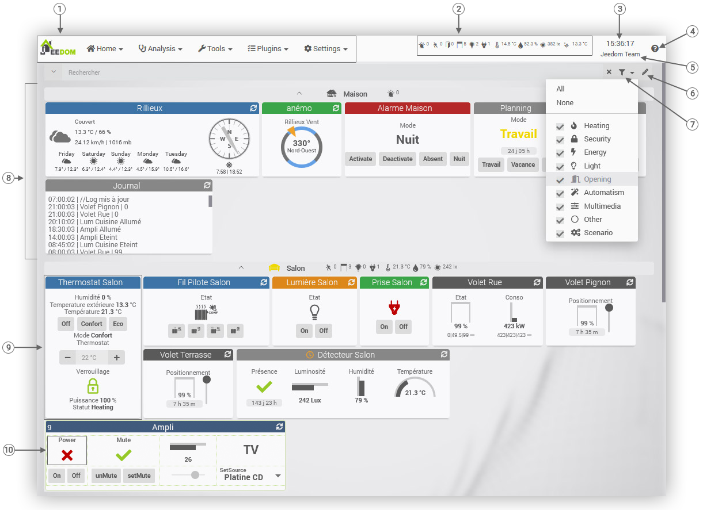

# Dashboard
**Home → Dashboard**

<small>[Raccourcis clavier/souris](shortcuts.md)</small>

Das Dashboard ist eine der Hauptseiten von Jeedom. Es zeigt einen Bericht über Ihre gesamte Hausautomation an.
Dieser Bericht wird (im Gegensatz zu Ansichten und Designs) von Jeedom selbst erstellt und enthält alle sichtbaren Objekte und deren Ausrüstung.

- 1 : Jeedom Hauptmenü.
- 2 : Globale Zusammenfassung.
- 3 : Browserzeit, Verknüpfung zur Zeitleiste.
- 4 : Schaltfläche, um auf die Dokumentation der aktuellen Seite zuzugreifen.
- 5 : Name Ihres Jeedom, Verknüpfung zur Konfiguration.
- 6 : Bearbeitungsmodus (Kacheln neu anordnen / in der Größe ändern).
- 7 : Nach Kategorien filtern.
- 8 : Objekt : Symbol, Name und Zusammenfassung sowie deren Ausstattung.
- 9 : Gerätekachel.
- 10 : Widget bestellen.

> **Spitze**
>
> Die Anzeigereihenfolge der Objekte im Dashboard ist die in **Analyse → Zusammenfassung der Hausautomation**. Sie können diese Reihenfolge auf dieser Seite durch Ziehen und Ablegen ändern.

Damit Geräte im Dashboard angezeigt werden, muss dies der Fall sein :
- Sei aktiv.
- Sei sichtbar.
- Haben Sie als übergeordnetes Objekt ein Objekt im Dashboard sichtbar.

Beim ersten Erscheinen der Ausrüstung im Dashboard versucht Jeedom, die Größe der Kachel korrekt anzupassen, um alle Befehle und ihre Widgets anzuzeigen.
Um ein ausgewogenes Dashboard zu erhalten, können Sie mit dem Stift oben rechts in der Suchleiste in den Bearbeitungsmodus wechseln, um die Größe der Gerätekacheln zu ändern und / oder sie neu zu ordnen.

Wenn Sie die Maus über eine Bestellung bewegen, wird unten links auf der Kachel eine farbige Markierung angezeigt:
- Blau für eine Info-Bestellung. Wenn es protokolliert ist, öffnet ein Klick darauf das Protokollfenster.
- Orange für einen Aktionsbefehl. Ein Klick löst die Aktion aus.

Außerdem können Sie auf den Titel der Kachel (den Namen des Geräts) klicken, um die Konfigurationsseite dieses Geräts direkt zu öffnen.

> **Spitze**
>
> Über das Menü können Sie direkt zu einem einzelnen Objekt in Ihrer Hausautomation wechseln **Home → Dashboard → Objektname**.
> Auf diese Weise haben Sie nur die Ausrüstung, die Sie interessiert, und können die Seite schneller laden.

- Oben links befindet sich ein kleines Symbol, mit dem der Baum der Objekte beim Schweben angezeigt wird.
- In einem Suchfeld können Sie nach Geräten nach Name, Kategorie, Plugin, Tag usw. suchen.
- Das Symbol rechts neben dem Suchfeld wird verwendet, um die angezeigten Geräte nach ihrer Kategorie zu filtern. Mit einem mittleren Klick können Sie schnell eine einzelne Kategorie auswählen.
- Ganz rechts können Sie über eine Schaltfläche in den Bearbeitungsmodus wechseln, die Reihenfolge der Kacheln ändern (auf das Widget klicken - ablegen) oder die Größe ändern. Sie können die Reihenfolge der Bestellungen in einer Kachel auch neu anordnen.

- Durch Klicken auf eine Objektzusammenfassung filtern Sie, um nur die Geräte anzuzeigen, die sich auf dieses Objekt beziehen und die sich auf diese Objektzusammenfassung beziehen.

- Ein Klick auf eine Bestellung vom Informationstyp zeigt den Verlauf der Bestellung an (sofern er historisch ist).
- Ein Strg + Klicken auf einen Befehl vom Typ Information zeigt den Verlauf aller Befehle (historisch) für diese Kachel an.
- Ein Klick auf die Informationen *Zeit* eines Aktionsbefehls zeigt den Verlauf des Befehls an (falls er historisiert ist).

## Bearbeitungsmodus

Im Bearbeitungsmodus (*der Bleistift oben rechts*), Sie können die Größe der Kacheln und ihre Anordnung im Dashboard ändern.

Die Geräteaktualisierungssymbole werden durch ein Symbol ersetzt, das den Zugriff auf ihre Konfiguration ermöglicht. Dieses Symbol öffnet ein Bearbeitungsfenster mit den Anzeigeparametern des Geräts und seiner Steuerelemente.

Auf jedem Objekt rechts neben seinem Namen und seiner Zusammenfassung können Sie mit zwei Symbolen die Höhe aller Kacheln des Objekts am höchsten oder niedrigsten ausrichten.

## Jeedom Menüleiste

> **Spitze**
>
> - Klicken Sie auf die Uhr (Menüleiste) : Öffnen Sie die Timeline.
> - Klicken Sie auf den Namen des Jeedom (Menüleiste)) : Öffnet Einstellungen → System → Konfiguration.
> - Klicken Sie auf ? (Menüleiste) : Öffnet die Hilfe auf der aktuellen Seite.
> - Flucht auf ein Forschungsfeld : Löschen Sie das Feld und brechen Sie diese Suche ab .
