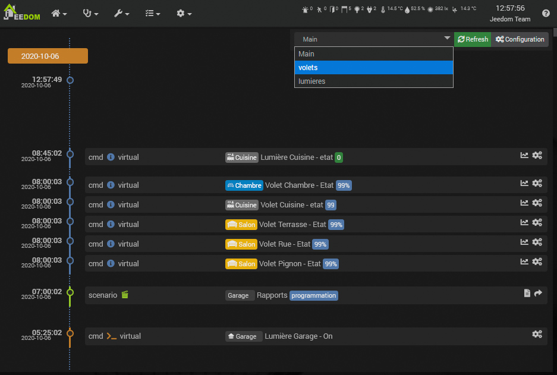

# Timeline
**Analyse → Zeitleiste**

## Timeline

Auf der Seite Zeitleiste können Sie Ereignisse wie Auftragsänderungen chronologisch anzeigen *die Info*, Befehl wird ausgelöst *Aktion*, und Szenarioausführungen.

Um sie anzuzeigen, müssen Sie zuerst die Verfolgung der gewünschten Befehle oder Szenarien auf der Zeitachse aktivieren. Anschließend treten diese Ereignisse auf.

- **Szenario** : Entweder direkt auf der Szenarioseite oder auf der Szenarioübersichtsseite, um dies in großen Mengen zu tun".
- **Bestellt** : Entweder in der erweiterten Konfiguration des Befehls oder in der Konfiguration des Verlaufs, um dies in "Masse" zu tun".

Die Zeitleiste *Main* enthält immer alle Ereignisse. Sie können die Zeitleiste jedoch nach filtern *Mappe*. An jeder Stelle, an der Sie die Zeitleiste aktivieren, haben Sie ein Feld, in das Sie den Namen eines Ordners eingeben können, ob vorhanden oder nicht.
Sie können die Zeitleiste dann nach diesem Ordner filtern, indem Sie sie links neben der Schaltfläche auswählen *Aktualisierung*.

> **Hinweis**
>
> Wenn Sie keinen Ordner mehr verwenden, wird dieser in der Liste angezeigt, solange Ereignisse vorhanden sind, die mit diesem Ordner verknüpft sind. Es wird von selbst aus der Liste verschwinden.

> **Trinkgeld**
>
> Sie haben Zugriff auf die Fenster &quot;Szenarioübersicht&quot; oder &quot;Verlaufskonfiguration&quot; direkt über die Timeline-Seite.

Sobald Sie die Verfolgung in der Zeitleiste der gewünschten Befehle und Szenarien aktiviert haben, können Sie sie in der Zeitleiste anzeigen.

> **Wichtig**
>
> Sie müssen auf neue Ereignisse warten, nachdem Sie das Tracking auf der Timeline aktiviert haben, bevor sie angezeigt werden.

## Affichage

Die Zeitleiste zeigt die aufgezeichneten Ereignisse an, die Tag für Tag vertikal versetzt sind.

Für jede Veranstaltung haben Sie:

- Datum und Uhrzeit der Veranstaltung,
- Die Art des Ereignisses: Ein Info- oder Aktionsbefehl oder ein Szenario mit dem Befehls-Plugin für Befehle.
- Der Name des übergeordneten Objekts, der Name und je nach Typ, Status oder Auslöser.

- Ein Befehlstypereignis zeigt rechts ein Symbol zum Öffnen der Befehlskonfiguration an.
- Bei einem Ereignis vom Typ Szenario werden rechts zwei Symbole angezeigt, mit denen Sie zum Szenario wechseln oder das Szenarioprotokoll öffnen können.

Oben rechts können Sie einen Zeitleistenordner auswählen. Dies muss vorher erstellt werden und Ereignisse enthalten.
