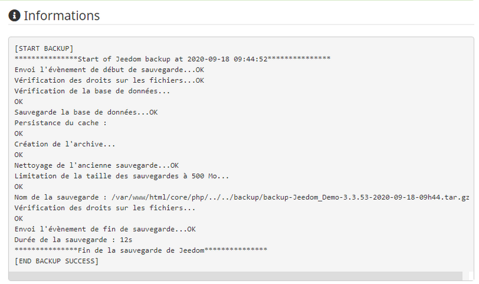

# Migration von Version (V3 → V4)

Lassen Sie uns gemeinsam die wichtigsten Aktionen entdecken, die implementiert werden müssen, um unter den besten Bedingungen von der Version von Jeedom zu migrieren. Dieses Tutorial basiert auf dem konkreten Fall einer Migration von V3 auf V4.

## Jeedom-Backup

Vor jedem Jeedom-Update ist es wichtig sicherzustellen, dass Sie die notwendigen Vorkehrungen getroffen haben, um im Falle von Schwierigkeiten schnell eine funktionierende Heimautomatisierungsinstallation wiederherstellen zu können.

### Backup-Erstellung

Wir erstellen zunächst die Sicherungsdatei Ihrer aktuellen Installation.

Gehen wir zum **Zahnradmenü**, oben in der Navigationsleiste, links neben der Uhr, dann klicken Sie auf das Untermenü **Sicherungen** um auf die zuzugreifen [Komponente, die Sicherungen verwaltet](https://doc.jeedom.com/de_DE/core/3.3/backup):    

Um das Backup zu erstellen, klicken wir auf die grüne Schaltfläche **Wurf** im Abschnitt mit dem Titel **Sicherungen** :    

Bestätigen Sie die Nachricht, in der Sie aufgefordert werden, Ihren Wunsch zu bestätigen, mit einem Backup von Jeedom fortzufahren, indem Sie auf die Schaltfläche klicken **OK** :    

Der Sicherungsvorgang beginnt. Dies kann einige Zeit dauern, Sie können den Fortschritt im benannten Fenster verfolgen **Information** :    

Wenn alles normal läuft, wird das Ende des Vorgangs durch die Meldung angezeigt :      
``***************Fin de la sauvegarde de Jeedom*************** [END BACKUP SUCCESS]``

Die Sicherungsdatei wurde korrekt in Jeedom generiert.

### Backup-Download

So wie es aussieht, ist das zuvor erstellte Backup nur von Jeedom aus zugänglich. Im Falle von Schwierigkeiten während eines Updates kann es jedoch sein, dass Jeedom oder der Computer, der es hostet, nicht mehr erreichbar sind. Wir werden daher sehen, wie die Sicherungsdatei auf einem Computer außerhalb von Jeedom wiederhergestellt werden kann.

Im Spiel **Lokale Sicherungen**, Es muss sichergestellt werden, dass das im vorherigen Absatz erstellte Backup auf der Leitung gut informiert ist **Sicherungen verfügbar** Bestätigen Sie mit Datum und Uhrzeit, die im Dateinamen erscheinen. Ist dies tatsächlich der Fall, können wir nun auf den grünen Button klicken **Herunterladen** :    

Die Sicherungsdatei wird dann auf Ihren Computer heruntergeladen. Bewahren Sie sie genau auf, da sie die Kopie Ihres gesamten Jeedom zum Zeitpunkt der Sicherung enthält.

## Einfaches Migrationstool

Jetzt, da wir das Backup unseres Jeedom gesichert haben, können wir mit dem Upgrade in Ruhe fortfahren.

Seit V3.3.54 wurde ein einfaches Migrationstool implementiert **Update-Center**. Um darauf zuzugreifen, müssen Sie zu gehen **Zahnradmenü**, oben in der Navigationsleiste, links neben der Uhr, dann klicken Sie auf das Untermenü **Update-Center**.

Klicken Sie im Update-Center auf die orangefarbene Schaltfläche mit der Bezeichnung **Aktualisieren Sie V4** um das modale Migrationsfenster zu öffnen :    

### Voraussetzungen

Das Upgrade-Fenster analysiert das System und alle auf Ihrem Computer installierten Plugins aus dem Jeedom-Markt, um die angekündigte Kompatibilität mit V4 zu überprüfen. Es zerfällt in 2 Teile :

- Der obere Teil präsentiert einige Neuerungen, die es in V4 zu entdecken gibt, mit einem Banner, das allgemein die Kompatibilität der installierten Plugins zusammenfasst :    

>**WICHTIG**
>
>Es ist nicht möglich, auf eine Installation zu migrieren, deren Umgebung älter ist als ``Debian Stretch 9.X`` *(``Debian 8.X Jessie`` oder niedriger)*. Sie werden auch aufgefordert, alle als veraltet identifizierten Plugins zu entfernen.

- Der untere Teil besteht aus einer Tabelle, in der alle installierten Plugins sowie deren bestätigte Kompatibilität mit dieser neuen Version aufgeführt sind :    

> **WICHTIG**    
>
>Diese neue Version von Jeedom bringt große Änderungen mit sich. Infolgedessen werden Widgets von Drittanbietern und bestimmte Designanpassungen, die in V3 verwendet werden, wahrscheinlich nicht mehr wie gewünscht angezeigt oder reagieren und erfordern möglicherweise Ihren Eingriff nach dem Wechsel zu V4.

### Aktualisierung

Nachdem wir nun alle wichtigen Informationen gelesen haben, die Sie wissen müssen, bevor Sie unser Jeedom aktualisieren, können wir die Migration starten, indem Sie auf die orangefarbene Schaltfläche klicken **Aktualisieren Sie V4** oben rechts im Modalfenster.

> **WISSEN**   
>
>Die Taste **Aktualisieren Sie V4** wird erst anklickbar, wenn das gesamte Fenster konsultiert wurde. Scrollen Sie also unbedingt zum Ende der Seite.

Ein Pop-up-Fenster öffnet sich und teilt uns mit, dass vor der Migration automatisch ein vollständiges Backup durchgeführt wird, damit wir bei Bedarf schnell und einfach zu V3 zurückkehren können.
Um den Migrationsprozess zu starten, klicken Sie auf **OK** :    

Sie wechseln dann auf die Seite mit den Migrationsprotokollen, die mit der Sicherung der aktuellen Installation beginnen, bevor die Plugins und der Kern aktualisiert werden.

> **WICHTIG**    
>
>Abhängig von der Hardware, auf der Jeedom installiert ist, dauert dieser Vorgang wahrscheinlich mehrere Minuten. Es ist von größter Bedeutung, dass der Migrationsprozess vollständig ausgeführt wird.

Sobald der Migrationsvorgang abgeschlossen ist, wird oben auf dem Bildschirm ein grünes Banner mit der Meldung angezeigt ***Die Operation ist erfolgreich. Bitte drücken Sie "F5", um die neuesten Nachrichten zu erhalten*** :    

Es bleibt also nur noch die Taste „F5“ auf der Tastatur zu drücken *(oder aktualisieren Sie die Seite)* um den effektiven Übergang zu V4 zu sehen. Es ist möglich, dass einige Plugins nach der Migration erneut nach einer Aktualisierung fragen, zögern Sie nicht, sie sofort zu aktualisieren.
