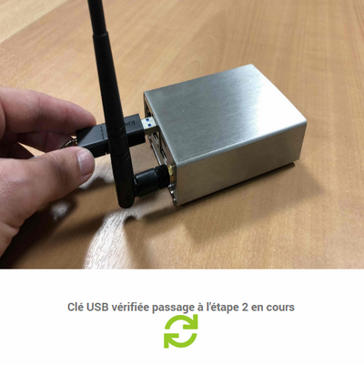
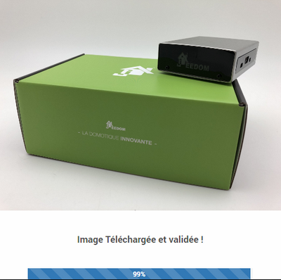
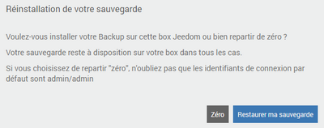

# Aktualisieren der Debian-Umgebung eines Smart

Wir werden das Verfahren für detailliert **Migration der Debian-Umgebung der Smartbox** damit Sie sich einen Überblick über die verschiedenen Schritte verschaffen können, bevor Sie es in die Praxis umsetzen. Beachten Sie, dass alle Schritte im Verlauf der Migration auch auf dem Bildschirm erklärt werden.

## Voraussetzungen

Die Migration der Debian-Umgebung und des Smart-Kernels ist ein langwieriger und komplexer Prozess, daher sind vor Beginn des Betriebs einige wesentliche Voraussetzungen zu berücksichtigen.

Insbesondere ist es notwendig :

- Energie **Bleiben Sie auf der Migrationsseite** während des gesamten Prozesses *(es dauert ungefähr 1h30)*,
- vorbereiten [ein USB-Schlüssel, der in formatiert ist **FAT32**](https://fr.wikihow.com/formater-en-FAT32){:target="\_blank"} und haben **mehr als 8 GB freier Speicherplatz**,
- auf dem sein **gleichen lokalen Netzwerk** als die Smart Box und greifen Sie von dort aus darauf zu **interne Adresse**.

>**WICHTIG**
>
>Wie üblich wird dringend empfohlen, a **aktuelle Sicherung** von Ihrem Jeedom im Voraus.

## Migration

### Migration einleiten

Sie haben die Möglichkeit, den Migrationsvorgang auf 2 Arten einzuleiten :

- Indem Sie zum Menü gehen **Einstellungen → System → Bildwiederherstellung** :     

- Durch die Einladung zum **Update-Center** wenn nötig :     

### Schritt 1

Der erste Schritt bei der Migration besteht darin, die Hardware vorzubereiten und zu überprüfen. Die oben genannten Voraussetzungen werden in einem Popup-Fenster aufgerufen und Sie werden aufgefordert, einen USB-Stick einzustecken *(in FAT32 formatiert)* mit mehr als 8 GB freiem Speicherplatz in der Smartbox.

Sobald das USB-Laufwerk angeschlossen ist, können Sie auf den Pfeil klicken, um den Vorgang zu starten :

Wenn die Voraussetzungen validiert sind, können wir mit Schritt 2 fortfahren :

>**INFORMATION**
>
>Es ist nicht notwendig, während des gesamten Vorgangs vor dem Bildschirm zu bleiben. Dies wird automatisch ausgeführt, bis es anbietet, ein Backup wiederherzustellen.

### 2. Schritt

Im zweiten Schritt wird ein Backup Ihres Jeedom erstellt, von dem eine Kopie auf dem USB-Stick gespeichert wird. Diese Sicherung wird auf Wunsch am Ende des Migrationsprozesses wiederhergestellt. Bei Bedarf befindet sich die Sicherung in einem Verzeichnis mit dem Namen ``Backup`` auf dem USB-Stick.

Wir empfehlen Ihnen dennoch, sicherzustellen, dass Sie an anderer Stelle ein aktuelles Backup von Jeedom zur Verfügung haben.

Die Dauer der Backup-Phase hängt von der Größe Ihrer Installation und den implementierten Remote-Backup-Optionen ab. Sie haben die Möglichkeit, den Vorgang zu beschleunigen, indem Sie das Senden von Market- und/oder Samba-Backups vorher deaktivieren.

### Schritt 3

Im dritten Schritt können Sie das Image herunterladen, das die neue Version der Debian-Umgebung enthält, und nach dem Herunterladen seine Gültigkeit überprüfen :

Dieser Schritt kann einige Zeit in Anspruch nehmen und hängt von der Geschwindigkeit Ihrer Internetverbindung sowie der Lese-/Schreibleistung des USB-Sticks ab :

### Schritt 4

Der mit Abstand wichtigste Schritt, da es um die eigentliche Hardwaremigration geht. Ziehen Sie in dieser Phase vor allem nicht den USB-Stick ab und unterbrechen Sie die Stromversorgung des Smart nicht !

Dieser Schritt dauert etwa 30 Minuten, danach startet die Smartbox neu. Dieser erste Neustart wird wahrscheinlich eine Weile dauern :

### Abschluss der Migration

Am Ende des Migrationsprozesses befindet sich die Smart Box nun in einer aktuellen Umgebung, aber mit einem leeren Jeedom. Der Abschluss des Verfahrens besteht daher entweder darin, mit einer sauberen Installation zu beginnen oder die im ersten Schritt erstellte Sicherung wiederherzustellen :

>**WICHTIG**
>
>**Achten Sie darauf, den USB-Stick am Ende des Vorgangs aus der Smartbox zu entfernen.**

Glückwunsch, **Ihre Smartbox ist jetzt auf dem neuesten Stand und betriebsbereit** !

## Häufig gestellte Fragen

>**Der Migrationsprozess läuft gut, jedoch scheinen sich nach dem Neustart der Box keine Änderungen ergeben zu haben ?**    
>Das bedeutet, dass der verwendete USB-Stick vom Migrationstool nicht richtig erkannt wird. Bitte wiederholen Sie den Vorgang mit einem anderen USB-Stick oder [USB-Stick neu partitionieren](https://fr.wikihow.com/partitionner-une-cl%C3%A9-USB){:target="\_blank"} kümmern **nur eine Partition erstellen** *(Einzelne Partitur)*.

>**Ich kann mich nach der Migration der Umgebung nicht mehr bei Jeedom authentifizieren.**    
>Jeedom wurde nach dem Update der Debian-Umgebung neu installiert, solange Sie kein Backup wiederhergestellt oder einen neuen Benutzer erstellt haben, sind die Standardkennungen ***Administrator / Administrator***.

>**Meine Box ist nach der Migration der Umgebung nicht mehr erreichbar.**    
>Überprüfen Sie das Vorhandensein und die IP-Adresse der Jeedom-Box über die Schnittstelle Ihres Routers, falls diese ihre IP-Adresse geändert hat.

>**Einige Plugins funktionieren nach der Migration nicht mehr.**    
>Stellen Sie sicher, dass Sie Abhängigkeiten für Plugins, die sie benötigen, neu installiert haben *(Konsultieren Sie die Konfigurationsseite des Plugins)*.
