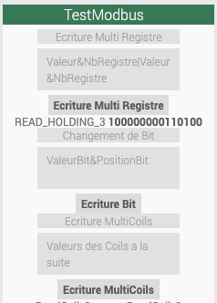

# Modbus

#Description

Plugin zum Lesen und Schreiben auf Ihren ModbusTCP/IP- und RTU-Geräten

# Plugin-Setup

Nachdem Sie das Plugin heruntergeladen haben, müssen Sie es wie jedes Jeedom-Plugin zuerst aktivieren :

Dann müssen Sie die Installation der Abhängigkeiten starten (auch wenn sie OK erscheinen) :

Starten Sie abschließend den Daemon :

Rien n'est à modifier dans le champ « Port socket interne » de la section « Configuration ».

Auf derselben Registerkarte müssen Sie den Ruhewert zwischen dem Aktualisieren Ihrer Ausrüstung auswählen (standardmäßig 5 Sek)

# Nutzung des Plugins

WICHTIG :

Um das Plugin zu verwenden, müssen Sie die Parameter Ihrer Ein-/Ausgänge Ihrer Modbus-Peripherie kennen (Datenformat, Bitreihenfolge usw...)

Für Befehle gibt es Parameter zur Auswahl :

Parameterdetails :
- Negativer Wert : für Formate vom Typ LONG/INT müssen Sie angeben, ob der Schreib-/Lesewert negativ sein soll
- Versatz : ob der Offset in den Registernummern bestimmter Modbus-Geräte berücksichtigt wird oder nicht
- Wählen Sie die Slider-Tonhöhe : Hiermit wählen Sie den Schritt des Schiebereglers im Falle eines Befehls vom Typ Aktion/Schieberegler, wenn Sie nicht ganzzahlige Werte senden möchten.

WIEDERGABESTEUERUNG :

Für Spuleneingänge :  
  - Sie fügen ein neues E/A-ModbusTCP hinzu und benennen den Befehl. Sie wählen einen Befehl vom Typ Info unter Binary oder Numeric type aus.
  - Wählen Sie die entsprechende Codefunktion : Wählen Sie in diesem Fall Fc1 read Coils
  - Es ist dann notwendig, das Startregister sowie die Anzahl der zu lesenden Bytes (Anzahl der Register)
  Beim Speichern wird der erstellte Befehl gelöscht, um so viele Coils-Befehle wie die angegebene Anzahl von Bytes zu erstellen.
  Ex: Wenn Sie ein Startregister von 1 und eine Anzahl von Bytes von 4 wählen, werden die Befehle erstellt : ReadCoil_1, ReadCoil_2, ReadCoil_3, ReadCoil_4
  - Sie können die ReadCoils natürlich nach Ihren Wünschen umbenennen.

  Für Bestandsregister :
  - Sie fügen ein neues E/A-ModbusTCP hinzu und benennen den Befehl. Sie wählen einen Befehl vom Typ Info unter Numerischer Typ.
  - Wählen Sie das entsprechende Format aus : Float oder Long/Integer
  - Das Startregister sowie die Anzahl der Bytes : Für Gleitkommazahlen beträgt die maximale Anzahl codierter Register 4 Register (64 Bit)

BEFEHLE SCHREIBEN:

 Auf Ihrem Gerät werden standardmäßig 3 Aktions-/Nachrichtentyp-Befehle erstellt; Multiregister-Schreiben, Bit-Schreiben und Multicoil-Schreiben

WICHTIG :

 Ihr Funktionsprinzip:

  - MultiRegister-Schreiben : In der Konfiguration des Befehls müssen Sie das Startregister sowie die Reihenfolge der Bytes und des Wortes eingeben.
  Standardmäßig ist der Funktionscode FC16. Bitte belassen Sie diese Konfiguration als Standard.

  Verwenden Sie diese Syntax, um die Werte in den Registern zu ändern:
  - valuetosend&nbofregister, getrennt durch | :   Ex:  120&1|214.5&4 Wir senden die Ganzzahl 120 an ein Register, beginnend mit dem konfigurierten Startregister,
  dann 214.5 in Float auf 4 Registern, die dem vorherigen folgen.

  Schreiben Sie für Float-Typen den Wert wie oben mit a .

    - Multicoil-Schreiben : In der Konfiguration des Befehls müssen Sie das Startregister eingeben
   Standardmäßig ist der Funktionscode fc15. Bitte belassen Sie diese Konfiguration als Standard.

   Verwenden Sie diese Syntax, um die Werte in den Registern zu ändern:
    -  Ex : 01110111 Damit werden vom konfigurierten Startregister die Werte True(1) oder False(0) an die Register gesendet

    - Bit schreiben : In der Konfiguration des Befehls müssen Sie das Startregister sowie die Reihenfolge der Bytes und des Wortes eingeben.
    Standardmäßig ist der Funktionscode fc03, da dieser Befehl den Wert des Registersatzes binär an die Befehlsinfo "infobitbinary".

    Bitte belassen Sie diese Konfiguration als Standard.

    Beim Befehl info "infobitbinary" haben Sie den Binärwert des Parameterregisters beim Befehl Write Bit.
    Um das Bit im Register zu ändern

    - valuetosend&PositionBit :   Ex:  1&4 Wir senden den Wert 1 an das Bit der Position 4 von rechts beginnend
    Auf dem Info-Befehl „infobitbinary“ sehen Sie den Wert 10000101, was dem binären Wert des Parameterregisters entspricht.
    Indem Sie 1&6 schreiben, haben Sie jetzt den Wert : 10100101 auf dem konfigurierten Register.

Auf einer Spule schreiben :

  Beispiel für Register 1 Ein:
  - Sie fügen ein neues E/A-ModbusTCP hinzu und benennen den Befehl. Sie wählen einen Aktionstypbefehl unter Standardtyp aus.
  - Wählen Sie Fc5 Write Single Coil
  - Abgangsregister : 1
  - Anzahl Bytes : 1
  - Geben Sie 1 in den zu sendenden Wert ein

  Beispiel für Register 1 Aus:
  - Sie fügen ein neues E/A-ModbusTCP hinzu und benennen den Befehl. Sie wählen einen Aktionstypbefehl unter Standardtyp aus.
  - Wählen Sie Fc5 Write Single Coil
  - Abgangsregister : 1
  - Anzahl Bytes : 1
  - Geben Sie 0 in den zu sendenden Wert ein

Indem Sie auf diese Aktionsbefehle auf Ihrem Dashboard reagieren, senden Sie daher True oder False an Ihre Coils.

In ein Halteregister schreiben :

 - Sie fügen ein neues E/A-ModbusTCP hinzu und benennen den Befehl. Sie wählen einen Aktionstypbefehl unter Schiebereglertyp aus.
 - Wählen Sie Fc5 Write Single Register
 - Wählen Sie das Format, das an die Registrierung gesendet werden soll (dies ändert den Schiebereglertyp auf Ihrem Dashboard, je nachdem, ob es Float oder Long/Integer ist)
 - Wählen Sie den Schritt des Schiebereglers (für Dezimalzahlen schreiben Sie mit a .   ex: 0.2)
 - Wählen Sie auch einen Min- und Max-Wert für diesen Schieberegler
