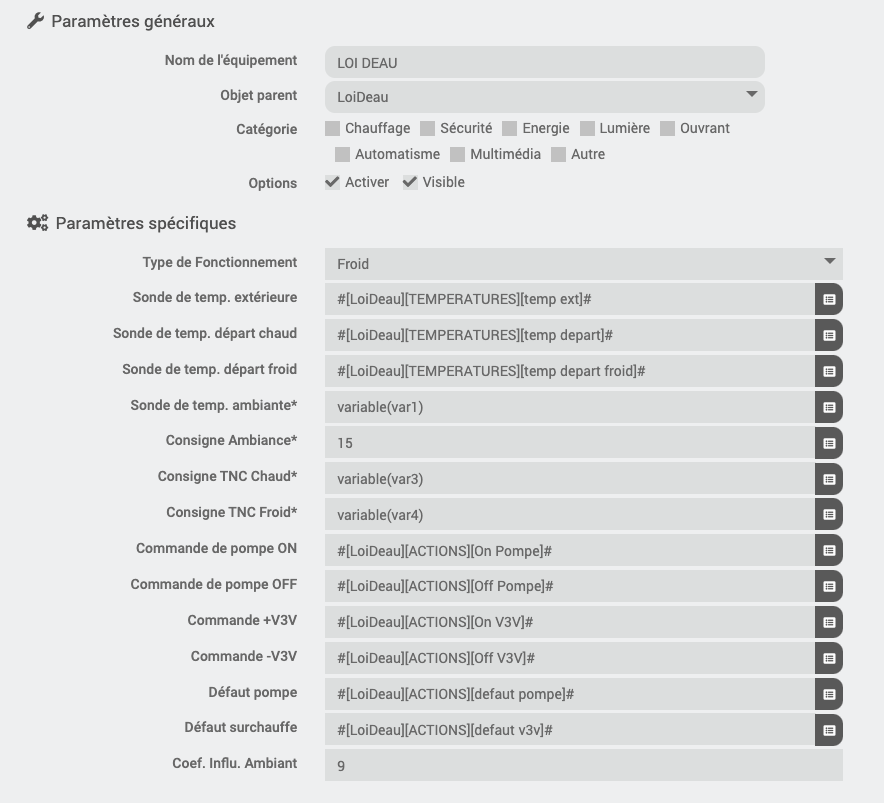

# Wasserrechts-Plugin

## Introduction

Mit dem Wassergesetz-Plugin können Benutzer auf der Grundlage einer spezifischen Berechnung unter Berücksichtigung der Außentemperatur auf eine Pumpe und/oder ein Dreiwegeventil (V3V) einwirken.

## Gerätekonfiguration

Um das Gerät zu konfigurieren, müssen Sie die spezifischen Parameter eingeben : 

1. Betriebsart (Heiß / Kalt))

2. Außentemperatursensor (Befehlsinfo)

3. Heißvorlauftemperaturfühler (Befehlsinfo)

4. Kalter Auslasstemperaturfühler (Befehlsinfo)

5. Umgebungsvorlauftemperaturfühler (harter Wert, eine Variable oder ein Infobefehl))

6. Umgebungssollwert (harter Wert, eine Variable oder ein Infobefehl))

7. Heißer TNC-Sollwert (harter Wert, eine Variable oder ein Info-Befehl))

8. TNC-Kaltsollwert (harter Wert, eine Variable oder ein Infobefehl))

9. Pumpensteuerung EIN (Aktionssteuerung)

10. +V3V-Befehl (Aktionsbefehl))

11. -V3V-Befehl (Aktionsbefehl))

12. Pumpenfehler (Infobefehl)

13. Überhitzungsfehler (Befehlsinfo)

14. Koeff. Influ. Umgebung (harter Wert, Standard 1)

## Utilisation

1. Betriebsmodus (Aus / Auto / Erzwungen))

2. Heizsollwertparameter (-10°C-Sollwert, 0°C-Sollwert, +10°C-Sollwert, +20°C-Sollwert))

3. Kaltsollwertparameter (Sollwert +20 °C, Sollwert +30 °C, Sollwert +40 °C))

## Haupteigenschaften

1. Berechnen und aktualisieren Sie den Warmwasser-Sollwert bei Änderung der Außentemperatur oder Änderung eines der Warmwasser-Sollwertparameter : 

„
calculLoiEau
WENN probeTempExt ≥ 10 DANN
     BerechnungWaterLaw = (((cons10ext - cons20ext)/10) x (10 - (tempExt - 10))) + cons20ext
SINON
     WENN probeTempExt ≥ 0 DANN #zwischen 0 und 9,99
          BerechnungWaterLaw = (((cons0ext - cons10ext)/10) x (10 - tempExt)) + cons10ext
     ELSE #ist kleiner als 0
          BerechnungWaterLaw = (((consLess10ext - cons0ext)/10) x (-1 x tempExt)) + cons0ext
„

2. Berechnen und aktualisieren Sie den Kaltwassersollwert bei Änderung der Außentemperatur oder Änderung eines der Kaltwassersollwertparameter : 

„
calculLoiEau
WENN probeTempExt ≥ 20 DANN
     BerechnungWaterLaw = (((cons10ext - cons20ext)/10) x (10 - (tempExt - 10))) + cons20ext
SINON
     WENN probeTempExt ≥ 0 DANN #zwischen 0 und 9,99
          BerechnungWaterLaw = (((cons0ext - cons10ext)/10) x (10 - tempExt)) + cons10ext
     ELSE #ist kleiner als 0
          BerechnungWaterLaw = (((consLess10ext - cons0ext)/10) x (-1 x tempExt)) + cons0ext
„

3. Berechnung und Aktualisierung des Heizungsvorlaufsollwerts bei Änderung des Wassergesetzsollwerts oder Änderung des Raumsollwerts oder Änderung der Raumtemperatur oder Änderung des Koeffizienten. beeinflussen. Umgebungs :

„
BerechnungConsDeparture = BerechnungWasserGesetz + ((Umgebungssollwert – AmbianceTemp-Sonde) x AmbientInflu-Koef) + ((Umgebungssollwert – 20) x 2)
„

4. Aktion auf V3V-Befehl (HEAT) bei Änderung der Heizungsvorlauftemperatur oder Änderung des Heizungsvorlaufsollwerts :

„
WENN WaterTemp-Sonde < BerechnungConsStart DANN
     Befehlsaktion +V3V
SINON
     WENN WaterTemp-Sonde > BerechnungKonsStart DANN
          Befehlsaktion -V3V
     ANSONSTEN            
          Nichts tun
„

5. Aktion auf den Befehl V3V (COLD) bei Änderung der Heizungsvorlauftemperatur oder Änderung des Heizungsvorlaufsollwerts :

„
WENN WaterTemp-Sonde > BerechnungKonsStart DANN
     Befehlsaktion +V3V
SINON
     WENN WaterTemp-Sonde < BerechnungConsStart DANN
          Befehlsaktion -V3V
     ANSONSTEN            
          Nichts tun
„

6. Aktion auf Pumpenbefehl (HEAT) bei Änderung der Außentemperatur oder Änderung des TNC-Sollwerts oder durch Klicken auf die Schaltfläche „Übernehmen“ im Dashboard :

„
WENN-Modus = AUTO DANN
    WENN probeTempExt > setpointTNC+1 THEN
        Aktion des Befehls „Pumpe AUS“
    ANSONSTEN            
        WENN TempExt-Fühler < SetpointTNC-1 DANN
            Steueraktion „Pumpe EIN“
        SINON
            Nichts tun
SINON
    WENN Modus = AUS DANN
        Aktion des Befehls „Pumpe AUS“
    ANSONSTEN            
        WENN-Modus = FORCE THEN
            Steueraktion „Pumpe EIN“
            Befehlsaktion +V3V
„

7. Aktion auf Pumpenbefehl (KALT) bei Änderung der Außentemperatur oder Änderung des TNC-Sollwerts oder durch Klicken auf die Schaltfläche „Übernehmen“ im Dashboard :

„
WENN-Modus = AUTO DANN
    WENN probeTempExt > setpointTNC+1 THEN
        Steueraktion „Pumpe EIN“
    ANSONSTEN            
        WENN TempExt-Fühler < SetpointTNC-1 DANN
            Aktion des Befehls „Pumpe AUS“
        SINON
            Nichts tun
SINON
    WENN Modus = AUS DANN
        Steueraktion „Pumpe EIN“
    ANSONSTEN            
        WENN-Modus = FORCE THEN
            Aktion des Befehls „Pumpe AUS“
            Befehlsaktion +V3V
„