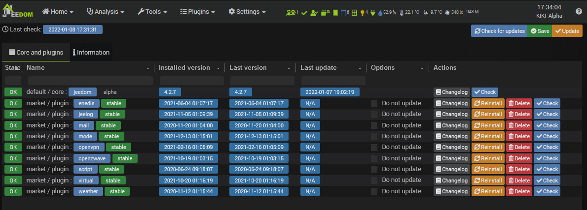

# Präsentation

Jeedom ist eine kostenlose Open-Source-Software, die auf jedem Linux-System installiert werden kann. Es ist Kernel-basiert mit mehreren Funktionen : Szenarioverwaltung, Text- und Toninteraktion mit dem Hausautomationssystem, Anzeige von Protokollen und Generierung von Kurven und Grafiken, Verknüpfung aller Geräte und angeschlossenen Objekte, Anpassung der Benutzeroberfläche ... Die klare und intuitive Oberfläche ermöglicht Ihnen die Einrichtung einer vollständigen Lösung ohne Entwicklungskenntnisse.

Jeedom benötigt für den Betrieb keinen Zugriff auf externe Server. Ihre gesamte Installation wird lokal verwaltet und Sie sind daher die einzigen, die darauf Zugriff haben, um absolute Vertraulichkeit zu gewährleisten.

Dank seiner Flexibilität und zahlreichen Anpassungsparametern kann jeder Benutzer seine eigene Jeedom-Heimautomatisierung erstellen. Mit Widgets, Ansichten und Designs haben Sie die völlige Freiheit, sich Ihre eigene Benutzeroberfläche vorzustellen, wenn Sie dies wünschen.

Jeedom ermöglicht viele Möglichkeiten, einschließlich :

- Verwalten Sie die Sicherheit von Gütern und Personen,
- Automatisieren Sie die Heizung für mehr Komfort und Energieeinsparungen,
- Visualisieren und verwalten Sie den Energieverbrauch, um Ausgaben zu antizipieren und den Verbrauch zu reduzieren,
- Kommunizieren Sie per Sprache, SMS, E-Mail oder mobilen Anwendungen,
- Verwalten Sie alle Automatisierungen des Hauses, Rollläden, Tore, Lichter usw.,
- Verwalten Sie Audio- und Video-Multimediageräte und verbundene Objekte.

Jeedom basiert auf dem Core (dem Kernel), der die Struktur und die zentralen Funktionen einbettet.

Anders [Plugins](https://market.jeedom.com) kann dann neue Funktionen vorschlagen.

Der Kern umfasst unter anderem :

## Dashboard / Zusammenfassung

*Geräte, einschließlich Aktoren oder Sensoren, werden nach Objekten organisiert. Objekte können beispielsweise physische Teile darstellen*.

[Synthese](/de_DE/core/4.1/overview)

[Armaturenbrett](/de_DE/core/4.1/dashboard)

## Historiques

*Alle Informationen können protokolliert werden (Temperaturkurven, Verbrauch, Türöffnungen usw.) und in Analyse → Verlauf oder über die Dashboard-Kacheln zugänglich sein.*

[Historisch](/de_DE/core/4.1/history)

[Zeitleiste](/de_DE/core/4.1/timeline)

## Szenarien

*Szenarien ermöglichen es Ihnen, Ihre Ausrüstung ganz oder teilweise zu automatisieren. Sie sind mit verschiedenen Blöcken aufgebaut. Bedingte Blöcke (If, Then, Else), Aktionen, Programmierung (IN x Minuten oder At hhmm), Schleifen, Kommentare oder PHP-Code. Alle Blöcke sind ineinander verschachtelbar und bieten endlose Möglichkeiten.*

[Mein erstes Drehbuch](/de_DE/concept/#tocAnchor-4)

## Erstellung von Widgets

*Jeedom bietet eine Widget-Erstellungs-Engine für Gerätesteuerungen. So können Sie zusätzlich zu den Basis-Widgets Ihre eigenen Widgets erstellen. Für fortgeschrittene Benutzer ist die Erstellung von Widgets auch direkt aus dem Code möglich.*

## Interactions

*Das Interaktionssystem in Jeedom ermöglicht es Ihnen, Aktionen über Text- oder Sprachbefehle auszuführen.*

## Update-Center

*Das Update-Center ermöglicht es Ihnen, alle Funktionen von Jeedom zu aktualisieren, einschließlich der Basissoftware (Core) und ihrer Plugins. Weitere Erweiterungsverwaltungsfunktionen sind verfügbar (Entfernen, Neuinstallieren, Überprüfen usw.).).*

# Market

Um diesen Kern herum befinden sich gepfropfte Plugins, die aller Art sein können :

-   Heimautomatisierungsprotokoll (Z-Wave, RFXcom, EnOcean usw.)),
-   IP-Protokoll (KNX, xPL…),
-   Kommunizierendes Objekt (Nest, Netatmo usw.)),
-   Hohes Niveau (Alarm, Thermostat usw.)),
-   Organisation (Kalender, Google Kalender),
-   Entwicklung (Scripting).

Diese Plugins können aus dem Market installiert werden und erweitern die Möglichkeiten von Jeedom.

Jeedom ermöglicht es jedem Plugin, auf normalisierter Basis mit einem anderen zu chatten. Dies ermöglicht beispielsweise die Verwendung des Thermostat- oder Alarm-Plugins mit jedem Hausautomatisierungsprotokoll oder sogar einem IP-Plugin oder Kommunikationsobjekt

