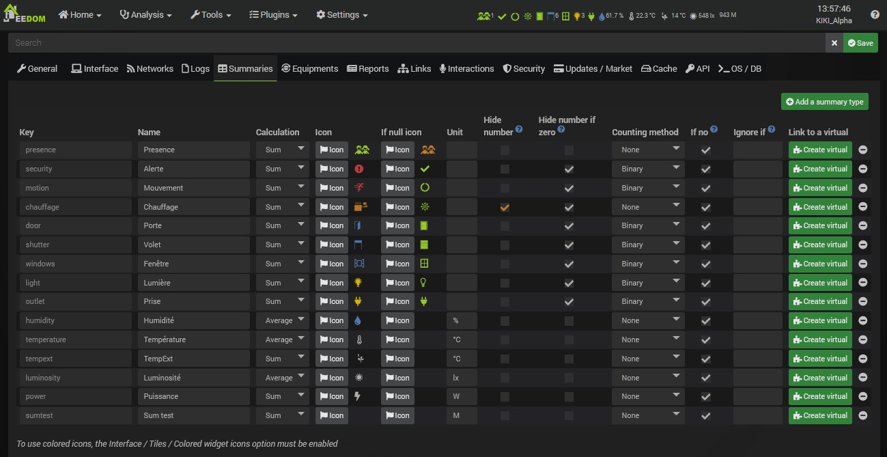
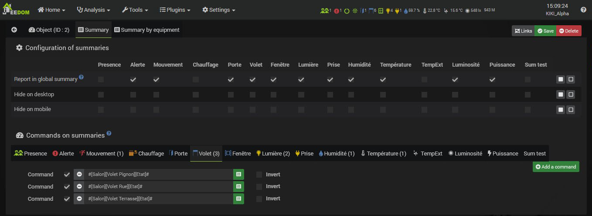

# The summaries

## Discovery of summaries

Jeedom offers a very simple and clear way to display the situation of different components of your home, so you can immediately see how many lights are on, shutters open, the state of the alarm, the temperature, etc.

The summaries are displayed as small icons in the Jeedom bar at the top, and on each object. On click, they allow you to directly see the equipment included in the summary you clicked on.

We must distinguish two types of summaries :

- The overall summary : This is the set of summary icons displayed in the Jeedom bar.
- Subject summaries : Each object has its own summary, displayed on the summary in the object, and on the Dashboard to the right of the name of the object.

The global summary cannot be set directly. It is a concentrate of summaries of other objects. For example, if one light is on in the kitchen and two in the living room, the overall summary will show three lights on. Of course, all this is configurable, as we will see below.

The summaries are therefore configured on each object, in the ... Summary tab !

> Remarque
>
> This documentation was written and illustrated on a Core v4.2. Some options may therefore vary depending on your version.

## General summary configuration

Before seeing the configuration on an object, to be able to configure a summary, there must be.

Go to **Settings → System → Configuration** then on the tab **Summaries**.

Here you have the list of all the summaries that you will be able to configure on each object. Here we can configure the summaries *Presence* (if you look closely, you see in the overall summary that there is a person at home), *Alert*, *Movement*, *Heating* etc. Et bien sûr, vous pouvez supprimer et ajouter des types de résumé ici, afin de les avoir à disposition ensuite sur les objets.

Rest assured, several things on this preview have been configured, but by default Jeedom has a list of summaries with standard parameters.

Let's go through what we will define here:

- **Key** : It is a value that must be unique in this list, which serves as a reference for the Core.
- **Name** : The name (type) of the summary, which you will find in the object parameters.
- **Calculation** : The type of calculation used for the displayed value. The sum for states, the average for e.g. temperatures, humidity, or the text value.
- **Icon** : The summary icon, displayed on the object and possibly in the overall summary.
- **If null icon** : Summary icon if its value is 0. Allows you to specify a different icon such as a closed shutter, a light off, or a different color, etc.
- **Unity** : Summary unit, which will be displayed to the right of the value.
- **Hide number** : Never displays the summary value (the number to the right of the icon).
- **Hide number if zero** : Allows you to hide the summary value, only if it is 0. We can thus wish to have the shutter icon open with their number, and the shutter icon closed without the number when all the shutters are closed.
- **Counting method** : If you count a binary data then you have to put this value to binary, example if you count the number of lamps lit but you just have the value of the dimmer (0 to 100), then you have to put binary, like that Jeedom considered that if the value is greater than 1, then the lamp is on.
- **If no** : Show summary even when its value is 0.
- **Ignore if** : Ignore an order for this summary if it has not been updated for x minutes.
- **Link to a virtual** : Starts the creation of a virtual device with commands corresponding to the values of the summary.
- **Delete summary** : The last button, on the far right, allows you to delete the summary of the row.

For example here :

- If we look at the animation, the 3rd summary, corresponding to **Movement** indicates in red that there is *1* movement. On the preview above, we see that it is the icon of the green circle, without number. Indeed, if you look at its line, the green icon is configured as **If null icon** and the value is not displayed because **Hide number if zero** is checked. Likewise, on the preview, the summary *Door* is in green, without a number, while the summary *Light* is yellow, with the number of lights on.

> Tip
>
> You can also change the order in which the summaries are displayed by dragging a line up or down with the mouse.

## Configuring object summaries

Once the list of summaries is available in Jeedom configuration, we can therefore use them on each object.

In **Tools → Objects**, here on the object Salon :

Here we have two parts :

### Configuring summaries

The columns of the table present each type of summary available in configuration as seen above. For each summary, three options :

- **Go up in the global summary** : This is where you choose, for each summary, whether that of this object should be taken into account in the overall summary. For example, here, the summary *Shutter* du Salon is checked, so it goes up in the global summary. So, if we look in the overall summary, in the 6 open panes displayed, there are those of the Show ! Conversely, if we look at the summary *TempExt* (16.1 ° C in the global summary), it is unchecked, because I only want to return the temperature of the Garden object in the global summary.
- **Hide in desktop** : To not display this summary next to the name of the object on the Dashboard.
- **Hide on mobile** : To not display this summary next to the name of the object in mobile.

### Summaries orders

Each tab represents a type of summary defined in the Jeedom configuration. Click on **Add an order** so that it is taken into account in the summary. You have the choice to select the command of any Jeedom equipment, even if it does not have this object as a parent.

Here we see the three components present in the summary of this object. And *Shutter* being activated in the global summary, they will be counted in this one too.

### Summary tab by device

This page allows you to select the summary orders in another way : it displays all the devices having the object as parent. On each device, by clicking on it, the list of device info commands is presented, with on the right the means of assigning this command to one or more summaries of the object.

If one or more summaries are already defined, the selector appears in orange, with the types of summaries checked on the right.

## Summaries and virtual

The summaries maintain with the [Virtual plugin](https://market.jeedom.com/index.php?v=d&p=market_display&id=21) an ambiguous relationship, not always easy to understand, but nevertheless very powerful, especially since Core v4.2 and actions on summary ! Still there ? We continue ...

Normally, you should now have created some summaries on your objects, and therefore have several info on your objects and in the global summary, like your open shutters, your lights etc.

These summaries are extremely practical to have an overall and visual state of the accommodation very quickly, and at the click of a button to be able to act on it by displaying the equipment of a summary. But if we continue the reasoning, that means that this info exists ... and that we can appreciate using it in a scenario !

Indeed, since my summary knows that I have 3 lights on, why not be able to test in a scenario IF a light is on? ? Or even trigger the scenario when a light comes on ? See even turn off all the lights in the living room with a single action ? Well all this is possible by linking a Virtual to a summary !

Go to **Settings → System → Configuration** then on the tab **Summaries**.

On the line *Light*, on the far right, click on the button **Create virtual**.

Now go to **Plugins → Programming → Virtual**

For each object with commands in the summary *Light*, you now have a new Virtual named *Abstract* with the parent object. You also have a new Virtual *Overall summary* without parent object, corresponding to the global summary of Jeedom.

By opening the Virtual Show and going to the tab **Orders**, here is what we find :

- An order **Info** *Light* : This has information on the number of lights on. In the Show, since we are on the Virtual of the summary of the Show.
- An order **Action** *Light Button On Light* : By triggering this action, we will turn on all the summary commands **Light**, here of the Salon object.
- An order **Action** *Light Button Off Light* : By triggering this action, we will turn off all the summary commands **Light**, here of the Salon object.
etc.

You should have understood the principle ! We now have, for each summary for which we have linked a Virtual, the corresponding information and actions available for each object, and for the global summary !

We can therefore now use it like any info or action of real equipment, in a scenario !

For example :

- A trigger#[None][Global Summary][Movement]# > 0` which will trigger a scenario as soon as movement is detected in the accommodation.
- An IF expression#[Salon][Summary][Light]# > 0 `which will test if a light is on in the Living room.
- An action `#[Salon][Summary][Shutter Shutter Button Slider]#`with value 0 which will close all shutters.

### Actions on summaries

As seen previously, Summary Virtuals not only have the *info* summaries, but also *action* available on the various devices configured in summary. These actions are of course accessible in the scenario, but also through the interface, from the summary icons here and there !

For example, if you have created the Summary virtuals for the summary *Light*, you can do a Ctrl + Click on the icon of this summary. A popup will then appear with the different actions, allowing you for example to turn off all the lights in the house at once !

We have it, the summaries represent a vast subject, which it is not always very easy to grasp at the beginning of the life of a Jeedomian, but which it is good to know !
