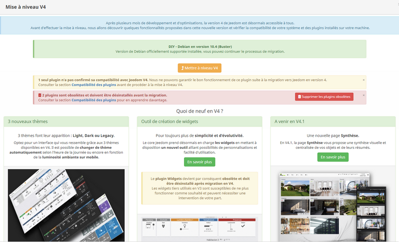
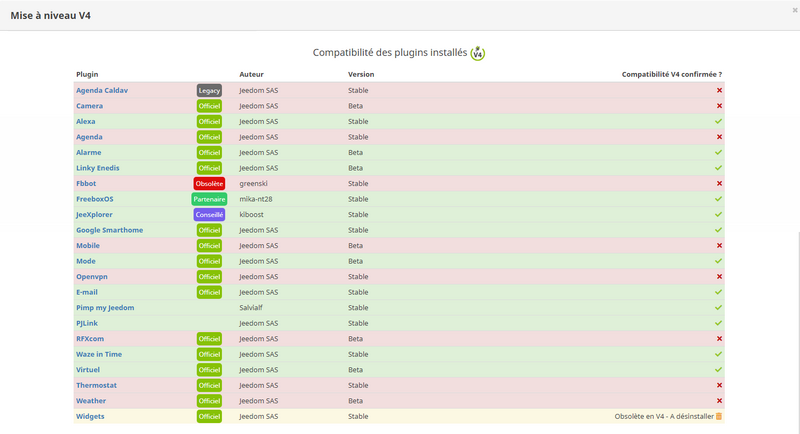
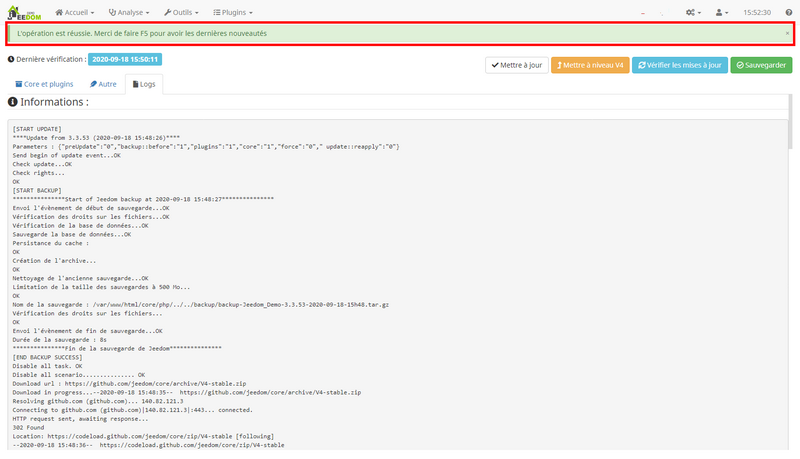

# Migrate from version (V3 → V4)

Let's discover together the main actions to be implemented to migrate from version of Jeedom in the best conditions. This tutorial is based on the concrete case of a V3 to V4 migration.

## Jeedom Backup

Before any Jeedom update, it is important to ensure that you have taken the necessary precautions to be able to quickly recover a functional home automation installation in the event of difficulties.

### Backup creation

We will first generate the backup file of your current installation.

Let's head to the **gear menu**, present at the top in the navigation bar, on the left of the clock, then click on the submenu **Backups** to access the [component that manages backups](https://doc.jeedom.com/en_US/core/3.3/backup):    

To create the backup we will click on the green button **Throw** in the section entitled **Backups** :    

Validate the message requesting confirmation of your wish to proceed with a backup of Jeedom by clicking on the button **Ok** :    

The backup process starts. This may take some time, you can follow the progress in the named window **Information** :    

If everything goes normally, the end of the process is indicated by the message :      
``***************Fin de la sauvegarde de Jeedom*************** [END BACKUP SUCCESS]``

The backup file was correctly generated in Jeedom.

### Backup Download

As it stands, the previously generated backup is only accessible from Jeedom. However, in the event of difficulties during an update, Jeedom or the machine that hosts it may no longer be accessible. We will therefore see how to recover the backup file on a computer outside Jeedom.

In the game **Local backups**, it is necessary to ensure that the backup created in the previous paragraph is well informed on the line **Backups available** confirming with the date and time that appear in the file name. If this is indeed the case, we can now click on the green button **To download** :    

The backup file is then downloaded to your computer, keep it precisely because it contains the copy of your entire Jeedom at the time of the backup.

## Easy migration tool

Now that we have secured the backup of our Jeedom, we can proceed with the upgrade serenely.

Since V3.3.54, an easy migration tool has been implemented in **Update Center**. To access it, you have to go to the **gear menu**, present at the top in the navigation bar, on the left of the clock, then click on the sub-menu **Update Center**.

Once in the update center, click on the orange button labeled **Upgrade V4** to open the migration modal window :    

### Prerequisites

The upgrade window will analyze the system and all the plugins installed on your machine from the Jeedom market in order to check the compatibility announced with V4. It breaks down into 2 parts :

- The upper part presents some innovations to discover in V4 with a banner generally summarizing the compatibility of the installed plugins :    

>**IMPORTANT**
>
>It will not be possible to migrate to an installation whose environment is older than ``Debian Stretch 9.X`` *(``Debian 8.X Jessie`` or lower)*. You will also be asked to remove any plugins identified as obsolete.

- The lower part consists of a table detailing all the plugins installed as well as their confirmed compatibility or not with this new version :    

> **IMPORTANT**    
>
>This new version of Jeedom brings major changes. As a result, third-party widgets and certain design customizations used in V3 are likely to no longer display or react as desired and may require your intervention following the switch to V4.

### Upgrade

Now that we have read all the important information to know before upgrading our Jeedom, we can start the migration by clicking on the orange button **Upgrade V4** at the top right of the modal window.

> **TO KNOW**   
>
>The button **Upgrade V4** only becomes clickable once the entire window has been viewed. So be sure to scroll to the bottom of the page.

A pop-up window opens and tells us that a full backup will be performed automatically before migration so that we can quickly and easily return to V3 if necessary.
To start the migration process, click **Ok** :    

You then switch to the page containing the migration logs which will start by backing up the current installation before updating the plugins and the core.

> **IMPORTANT**    
>
>Depending on the hardware on which Jeedom is installed, this operation is likely to last several minutes. It is paramount to let the migration process run to completion.

Once the migration operation is complete, a green banner is displayed at the top of the screen with the message ***The operation is successful. Please press `F5` to get the latest news*** :    

So all that remains is to press the `F5` button on the keyboard *(or refresh the page)* to see the effective transition to V4. It is possible that some plugins will ask to be updated again following the migration, do not hesitate to update them immediately.
