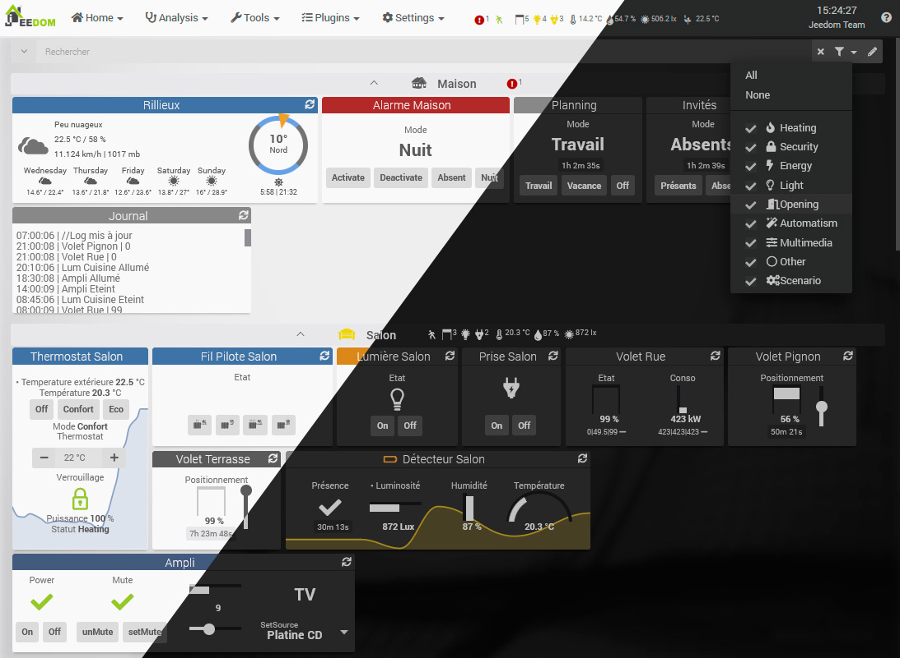

# Presentation

Jeedom is a free Open-Source software that can be installed on any Linux system. It is kernel based with multiple features : scenario management, text and sound interaction with the home automation system, display of logs and generation of curves and graphics, linking of all equipment and connected objects, customization of the interface... Its clear and intuitive allows you to set up a complete solution without development knowledge.

Jeedom does not require access to external servers to operate. Your entire installation is managed locally and you are therefore the only ones to have access to it to guarantee complete confidentiality.

Thanks to its flexibility and numerous customization parameters, each user can create their own Jeedom home automation. Using widgets, views and designs, you have total freedom to imagine your own interface if you wish.

Jeedom allows many possibilities including :

- Manage the security of goods and people,
- Automate heating for better comfort and energy savings,
- Visualize and manage energy consumption, to anticipate expenditure and reduce consumption,
- Communicate by voice, SMS, emails or mobile applications,
- Manage all the automations of the house, shutters, gate, lights, etc.,
- Manage audio and video multimedia devices and connected objects.

Jeedom is based on the Core (the kernel), embedding the structure and the central functions.

Different [plugins](https://market.jeedom.com) can then propose new functions.

The Core includes among others :

## Dashboard / Summary

*Devices, including actuators or sensors, are organized by objects. Objects can, for example, represent physical parts*.

[Synthesis](/en_US/core/4.1/overview)

[Dashboard](/en_US/core/4.1/dashboard)

## Historiques

*All information can be logged (temperature curves, consumption, door openings, etc.), and accessible in Analysis → History or from the Dashboard tiles.*

[Historical](/en_US/core/4.1/history)

[Timeline](/en_US/core/4.1/timeline)

## Scenarios

*Scenarios allow you to automate all or part of your equipment. They are built with different blocks. Conditional blocks (If, Then, Else), actions, programming (IN x minutes or At hhmm), loops, comments, or php code. All blocks are nestable within each other, providing endless possibilities.*

[My first script](/en_US/concept/#tocAnchor-4)

## Creation of widgets

*Jeedom offers a widget creation engine for equipment controls. You can thus create your own Widgets, in addition to the basic Widgets. The creation of Widgets is also possible directly from code, for advanced users.*

## Interactions

*The interaction system in Jeedom allows you to perform actions from text or voice commands.*

## Update Center

*The update center allows you to update all the features of Jeedom, including the basic software (core) and its plugins. Other extension management functions are available (remove, reinstall, verify, etc.).).*

# Market

Around this core are grafted plugins, which can be of all kinds :

-   Home automation protocol (Z-Wave, RFXcom, EnOcean, etc.)),
-   IP protocol (KNX, xPL…),
-   Communicating object (Nest, Netatmo, etc.)),
-   High level (alarm, thermostat, etc.)),
-   Organization (calendar, Google calendar),
-   Development (scripting).

These plugins can be installed from the Market and extend the possibilities of Jeedom.

Jeedom allows any plugin to chat with another on a normalized basis. This allows for example to use the thermostat or alarm plugins with any home automation protocol or even an IP plugin or communicating object

