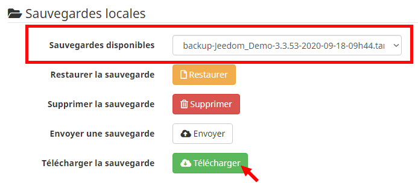
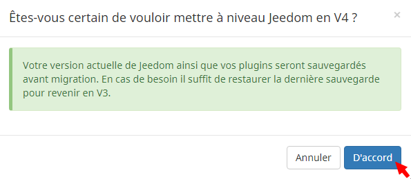

# Migrar desde la versión (V3 → V4)

Descubramos juntos las principales acciones que se implementarán para migrar de la versión de Jeedom en las mejores condiciones. Este tutorial se basa en el caso concreto de una migración de V3 a V4.

## Copia de seguridad de Jeedom

Antes de cualquier actualización de Jeedom, es importante asegurarse de haber tomado las precauciones necesarias para poder recuperar rápidamente una instalación domótica funcional en caso de dificultades.

### Creación de copia de seguridad

Primero generaremos el archivo de copia de seguridad de su instalación actual.

Vamos a la **menú de engranajes**, presente en la parte superior de la barra de navegación, a la izquierda del reloj, luego haga clic en el submenú **Copias de seguridad** para acceder a la [componente que gestiona las copias de seguridad](https://doc.jeedom.com/es_ES/core/3.3/backup):    

Para crear la copia de seguridad haremos clic en el botón verde **Lanzar** en la sección titulada **Copias de seguridad** :    

Valide el mensaje solicitando la confirmación de su deseo de proceder con una copia de seguridad de Jeedom haciendo clic en el botón **Correcto** :    

El proceso de copia de seguridad comienza. Esto puede llevar algún tiempo, puede seguir el progreso en la ventana nombrada **Información** :    

Si todo transcurre con normalidad, el final del proceso se indica mediante el mensaje :      
``***************Fin de la sauvegarde de Jeedom*************** [END BACKUP SUCCESS]``

El archivo de copia de seguridad se generó correctamente en Jeedom.

### Descarga de copia de seguridad

Tal como está, solo se puede acceder a la copia de seguridad generada previamente desde Jeedom. Sin embargo, en caso de dificultades durante una actualización, es posible que ya no se pueda acceder a Jeedom o la máquina que lo aloja. Por lo tanto, veremos cómo recuperar el archivo de copia de seguridad en una computadora fuera de Jeedom.

En el juego **Copias de seguridad locales**, es necesario asegurarse de que la copia de seguridad creada en el párrafo anterior esté bien informada en la línea **Copias de seguridad disponibles** confirmando con la fecha y hora que aparecen en el nombre del archivo. Si este es realmente el caso, ahora podemos hacer clic en el botón verde **Descargar** :    

Luego, el archivo de copia de seguridad se descarga en su computadora, guárdelo precisamente porque contiene la copia de todo su Jeedom en el momento de la copia de seguridad.

## Herramienta de migración fácil

Ahora que hemos asegurado la copia de seguridad de nuestro Jeedom, podemos continuar con la actualización serenamente.

Desde V3.3.54, se ha implementado una herramienta de migración fácil en **Centro de actualización**. Para acceder a él, tienes que ir a la **menú de engranajes**, presente en la parte superior de la barra de navegación, a la izquierda del reloj, luego haga clic en el submenú **Centro de actualización**.

Una vez en el centro de actualizaciones, haga clic en el botón naranja etiquetado **Actualizar V4** para abrir la ventana modal de migración :    

### Requisitos previos

La ventana de actualización analizará el sistema y todos los complementos instalados en su máquina desde el mercado Jeedom para verificar la compatibilidad anunciada con V4. Se descompone en 2 partes :

- La parte superior presenta algunas novedades para descubrir en V4 con un banner que generalmente resume la compatibilidad de los complementos instalados :    

>**IMPORTANTE**
>
>No será posible migrar a una instalación cuyo entorno sea más antiguo que ``Debian Stretch 9.X`` *(``Debian 8.X Jessie`` o bajo)*. También se le pedirá que elimine los complementos identificados como obsoletos.

- La parte inferior consta de una tabla en la que se detallan todos los plugins instalados así como su compatibilidad confirmada o no con esta nueva versión :    

> **IMPORTANTE**    
>
>Esta nueva versión de Jeedom trae cambios importantes. Como resultado, es probable que los widgets de terceros y ciertas personalizaciones de diseño utilizadas en V3 ya no se muestren o reaccionen como se desea y pueden requerir su intervención luego del cambio a V4.

### Mejora

Ahora que hemos leído toda la información importante que debe saber antes de actualizar nuestro Jeedom, podemos comenzar la migración haciendo clic en el botón naranja **Actualizar V4** en la parte superior derecha de la ventana modal.

> **A SABER**   
>
>El botón **Actualizar V4** solo se puede hacer clic una vez que se ha consultado toda la ventana. Así que asegúrese de desplazarse hasta la parte inferior de la página.

Se abre una ventana emergente que nos dice que se realizará automáticamente una copia de seguridad completa antes de la migración para que podamos volver rápida y fácilmente a V3 si es necesario.
Para iniciar el proceso de migración, haga clic en **Correcto** :    

Luego cambia a la página que contiene los registros de migración que comenzarán con una copia de seguridad de la instalación actual antes de actualizar los complementos y el núcleo.

> **IMPORTANTE**    
>
>Dependiendo del hardware en el que esté instalado Jeedom, es probable que esta operación dure varios minutos. Es fundamental dejar que el proceso de migración se ejecute hasta su finalización.

Una vez que se completa la operación de migración, se muestra un banner verde en la parte superior de la pantalla con el mensaje ***La operación es exitosa. Presione `F5` para obtener las últimas noticias*** :    

Así que todo lo que queda es presionar el botón `F5` en el teclado *(o actualiza la página)* para ver la transición efectiva a V4. Es posible que algunos complementos soliciten que se actualicen nuevamente después de la migración, no dude en actualizarlos de inmediato.
