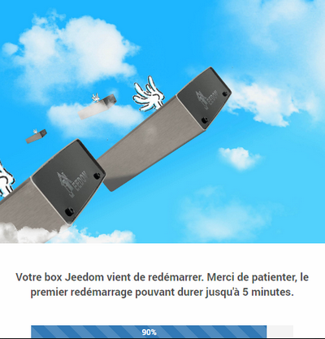

# Actualización del entorno Debian de un Smart

Detallaremos el procedimiento para **migración del entorno Debian del Smart box** para que puedas tener una visión general de los diferentes pasos antes de ponerlo en práctica. Tenga en cuenta que todos los pasos también se explican en la pantalla a medida que avanza la migración.

## Requisitos previos

La migración del entorno Debian y el kernel de Smart es un proceso largo y complejo, por lo que se deben tener en cuenta varios requisitos previos esenciales antes de iniciar la operación.

En particular, es necesario :

- poder **permanecer en la página de migración** durante todo el proceso *(tarda alrededor de 1h30)*,
- preparar [una llave USB formateada en **FAT32**](https://fr.wikihow.com/formater-en-FAT32){:target="\_blank"} y teniendo **más de 8 GB de espacio libre**,
- estar en el **misma red local** que el Smart box y acceda a él desde su **dirección interna**.

>**IMPORTANTE**
>
>Como de costumbre, se recomienda encarecidamente mantener un **copia de seguridad reciente** de tu Jeedom de antemano.

## Migration

### Iniciar migración

Tienes la posibilidad de iniciar el trámite de migración de 2 formas :

- Dirigiéndose al menú **Configuración → Sistema → Restaurar imagen** :     

- Al ser invitado a la **centro de actualización** cuando sea necesario :     

### Etapa 1

El primer paso en la migración es preparar y verificar el hardware. Los requisitos previos mencionados anteriormente se recuerdan en una ventana emergente y se le solicita que inserte una llave USB *(formateado en FAT32)* con más de 8GB de espacio libre en la Smart box.

Una vez insertada la unidad USB, puede hacer clic en la flecha para iniciar el proceso :

Cuando se validan los requisitos previos, podemos ir al paso 2 :

>**INFORMACIÓN**
>
>No es necesario permanecer frente a la pantalla durante todo el proceso. Esto se ejecutará automáticamente hasta que ofrezca restaurar una copia de seguridad.

### 2do paso

El segundo paso generará una copia de seguridad de su Jeedom, una copia de la cual se guardará en la llave USB. Esta copia de seguridad se restaurará al final del proceso de migración si lo desea. Si es necesario, la copia de seguridad está en un directorio llamado ``Backup`` en la llave USB.

Todavía le recomendamos que se asegure de tener una copia de seguridad reciente de Jeedom disponible en otro lugar.

La duración de la fase de copia de seguridad dependerá del tamaño de su instalación y de las opciones de copia de seguridad remota implementadas. Tienes la opción de acelerar el proceso deshabilitando previamente el envío de copias de seguridad de Market y/o Samba.

### Paso 3

El tercer paso le permitirá descargar la imagen que contiene la nueva versión del entorno Debian y verificar su validez después de la descarga :

Este paso puede llevar algún tiempo y dependerá de la velocidad de su conexión a Internet, así como del rendimiento de lectura/escritura de la llave USB :

### Paso 4

Con mucho, el paso más importante, ya que implica la migración real del hardware. Sobre todo, no desenchufes la llave USB ni cortes la alimentación del Smart durante esta fase !

Este paso dura unos treinta minutos, después de lo cual la caja inteligente se reiniciará. Es probable que este primer reinicio dure un tiempo :

### Completando la migración

Al final del proceso de migración, el cuadro inteligente ahora está en un entorno actualizado pero con un Jeedom en blanco. Por lo tanto, la finalización del procedimiento consistirá en comenzar desde una instalación limpia o en restaurar la copia de seguridad generada durante el primer paso :

>**IMPORTANTE**
>
>**Asegúrese de retirar la llave USB de la caja inteligente al final de la operación.**

Felicitaciones, **su caja inteligente ahora está actualizada y operativa** !

## Preguntas frecuentes

>**El proceso de migración va bien, sin embargo, parece que no se han producido cambios después de reiniciar la caja ?**    
>Esto significa que la herramienta de migración no reconoce correctamente la llave USB utilizada. Repita la operación con otra llave USB o [reparticione su unidad usb](https://fr.wikihow.com/partitionner-une-cl%C3%A9-USB){:target="\_blank"} cuidar de **crear solo una partición** *(Puntuación única)*.

>**Ya no puedo autenticarme en Jeedom luego de la migración del entorno.**    
>Jeedom se reinstaló después de la actualización del entorno Debian, siempre que no haya restaurado una copia de seguridad o creado un nuevo usuario, los identificadores predeterminados son ***administrador/administrador***.

>**Ya no se puede acceder a mi casilla después de la migración del entorno.**    
>Verifique la presencia y la dirección IP de la caja Jeedom desde la interfaz de su enrutador en caso de que haya cambiado su dirección IP.

>**Algunos complementos ya no funcionan después de la migración.**    
>Asegúrese de haber reinstalado las dependencias de los complementos que las requieren *(consultar la página de configuración del plugin)*.
