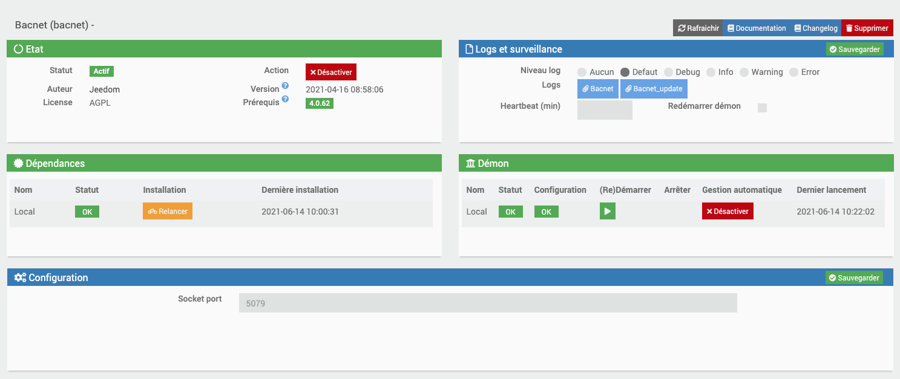

# Bacnet

#Description

El complemento Bacnet le permite recuperar información de su equipo Bacnet / Ip e interactuar con ella desde su Jeedom.

# Configuración del complemento

Después de descargar el complemento, primero debe activarlo, como cualquier complemento de Jeedom :

Luego, debe iniciar la instalación de las dependencias (incluso si aparecen bien) :

Finalmente, debemos iniciar el demonio :

Rien n'est à modifier dans le champ « Port socket interne » de la section « Configuration ».

En esta misma pestaña, debes elegir el valor Cron para actualizar tu equipo.

# Cómo declarar un nuevo dispositivo Bacnet en Jeedom

>**IMPORTANTE**
>
>Su equipo BACNET debe estar en la misma red que su Jeedom para ser detectado por él.

Rendez-vous dans le menu « Plugins → Energie → Bacnet » :

Llegas a la página siguiente:

Vous devez donc cliquer sur l'option « Nouvel équipement / Création commandes » :

Se iniciará un escaneo automático de su red para detectar los dispositivos Bacnet presentes en ella.
Puede tardar unos veinte segundos.

Después del escaneo, se mostrará una tabla con todas las entradas / salidas de su equipo.

El menú de la tabla donde puede buscar por columna :

Un ejemplo de detección de equipos Bacnet :

Dependiendo del fabricante del equipo, algunos valores no están disponibles; 

Todo lo que tiene que hacer es seleccionar las órdenes que se crearán marcando una de las opciones según su elección (tipo de comando info o tipo acción):

Valida, actualiza la página, y se habrá creado el equipo correspondiente en tu Jeedom; de forma predeterminada, se le asignará el nombre del DeviceID de su equipo Bacnet proporcionado por el fabricante (puede cambiar el nombre )

 Cliquez ensuite sur votre équipement créé, puis cocher « Activer » et « Visible » pour le voir apparaitre sur votre dashboard.

Para agregar comandos posteriormente a un equipo existente, debe rehacer la operación anterior : « Nouvel équipement / Création commandes » , et sélectionnez les commandes que vous désirez.

# Las órdenes

Rendez-vous dans l'onglet « Commandes » de la page de configuration du nouvel équipement Bacnet.

Ici vous pouvez masquer et rendre visibles les différentes commandes de type « action » et « info » disponibles (les commandes de type « info » peuvent également être historisées) :

Todo el equipo creado tendrá 2 comandos por defecto : une commande info « Connexion Bacnet » et une commande action « Refresh » , qui serviront à voir l'état de la connexion Bacnet sur votre dashboard, et à rafraichir les valeurs de vos commandes.

>**IMPORTANTE**
>
>Respecto a la escritura: por seguridad, el protocolo Bacnet proporciona por defecto un sistema de escritura con niveles de prioridad en las entradas / salidas de sus equipos.
Hay 16 niveles de prioridad (el nivel más bajo tiene prioridad sobre todos los demás)). Su equipo puede estar programado de tal manera que la función de escritura desarrollada en este complemento no tenga prioridad sobre la programación lógica del equipo / sistema por defecto.
Para E / S de tipo de salida, el complemento se configura con escritura de prioridad 8 (Operador manual).
Más información sobre el tema :

https://store.chipkin.com/articles/bacnet-why-doesnt-the-present-value-change

Para una escritura en un dispositivo Bacnet, ampliamos el PresentValue de la entrada / salida correspondiente.
Debe saber que los PresentValues del tipo de entradas / salidas: La salida analógica, la salida binaria y la salida multiestado siempre se pueden controlar.
Las entradas / salidas AnalogValue, BinaryValue o MultistateValue se pueden pedir si el fabricante ha implementado esta función. Queda a criterio exclusivo del fabricante. Consulte la documentación de su equipo para obtener más información al respecto.

Al crear las órdenes de tipo de escritura elegidas, también se creará una orden de acción asociada, que por defecto no es visible en el tablero.
Al hacer clic en él, restablece la tabla de prioridad de escritura de una entrada / salida a los valores predeterminados. 
Tendrá un nombre con << resetPrioritesEcriture >>
Para que este comando sea visible en su tablero, vaya a los comandos de su equipo y marque la casilla "Mostrar"
