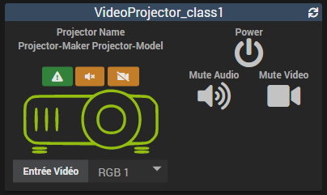
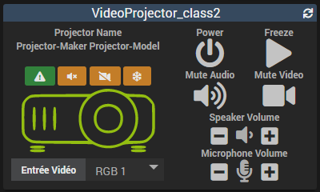

# Complemento PJLink

El complemento **PJLink** permite el control de proyectores de video compatibles con el protocolo *PJLink* para comunicarse en la red local.

La lista no exhaustiva de marcas compatibles con el protocolo *PJLink* es : **BenQ, Canon, Casio, Epson, Fujifilm, Hitachi, InFocus, Maxell, Mitsubishi, Nec, Panasconic, Ricoh, Sharp, Sky, Sony...**

Para obtener más información sobre los modelos que admiten el protocolo *PJLink*, por favor refiérase a [esta lista clasificada por año de comercialización](https://pjlink.jbmia.or.jp/english/list.html){:target = "\_ blank"} oa la documentación de su hardware.

> **Información importante**    
> El equipo compatible se divide en 2 clases, dependiendo de su equipo, no tendrá acceso a la misma información :
> * **Clase 1** : compatible con funciones básicas.
> * **Clase 2** : compatible con funciones básicas y avanzadas.

# Configuration

## Configuración del plugin

El complemento **PJLink** no requiere ninguna configuración específica y solo debe activarse después de la instalación.

El complemento usa un *Cron5* para actualizar los datos cada 5 minutos.

## Configuración del equipo

Para acceder a los diferentes equipos **PJLink**, ir al menú **Complementos → Multimedia → PJLink**.

> **A saber**    
> El botón **+ Agregar** le permite agregar nuevos equipos **PJLink**.

En la página del equipo, complete el'**Dirección IP** material *(obligatoire)* así como el **Contraseña** si se ha establecido una contraseña en el hardware *(facultatif)*.    
El **Puerto** utilizado por defecto por el protocolo es el **4352**. Para ser modificado solo con pleno conocimiento de los hechos.    
El **Tiempo de espera** está configurado de forma predeterminada en **5** segundos. Puede aumentar este retraso si su hardware tarda más en responder.

Marca la casilla **Activar** y haga clic en el botón **Guardar**. El complemento creará los comandos correspondientes a su material y recuperará la información disponible.

**Clase 1 :**

**Clase 2 :**

# Plantilla de widget

La visual del equipo **PJLink** es refinado y relevante. Se muestra información diferente al pasar el cursor sobre cada icono.

No tendrás acceso a los mismos comandos en función de las posibilidades que ofrece tu equipo.

## Clase 1

*  : Verde, este icono indica que no hay ningún error en curso. Si se detecta un error, el icono será naranja y el contenido del error se indicará al pasar el mouse o en la última información directamente en el dispositivo.
*  : Se muestra si el sonido está silenciado *(Silenciar el audio)*.
*  : Se muestra si el video está cortado *(Silenciar video)*.
* El icono del proyector de video cambia de color según el estado del equipo :
  * **Verde** : El proyector de video está encendido.
  * **Rojo** : El proyector de video está apagado.
  * **Azul** : El video proyector se está enfriando.
  * **Naranja** : El proyector de video se está calentando.
* **Entrada de video** : Selecciona la entrada de video *(input)*.
* **Poder** : Encender / apagar el equipo.
* **Silenciar el audio** : Para detener o reanudar la transmisión de sonido.
* **Silenciar video** : Para detener o reanudar la transmisión de video.

## Clase 2

Todos los controles de clase 1 son accesibles y también :

*  : Aparece si el audio y el video están congelados *(Freeze)*.
* **Congelar** : Congelar / Descongelar video y audio.
* **Volumen del altavoz** : El botón "**-**" reduce el volumen del sonido y "**+**" para aumentarlo.
* **Volumen del micrófono** : El botón "**-**" disminuye el volumen del micrófono y "**+**" para aumentarlo.
