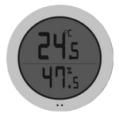
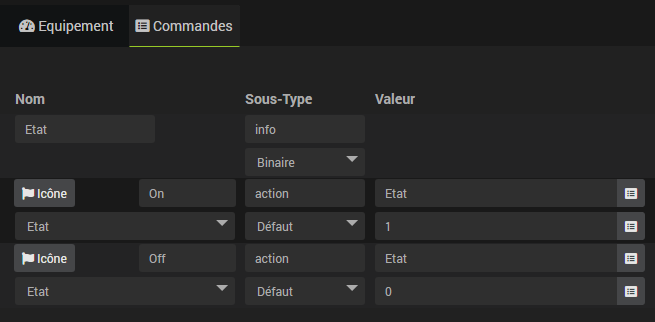
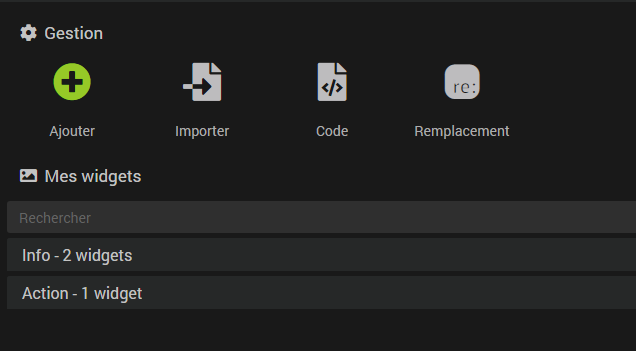
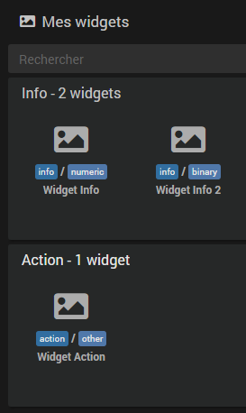

# Widgets

Un widget est la représentation graphique d'une commande. Chaque widget est spécifique au type et au sous-type de la commande sur laquelle il doit être appliqué ainsi qu'à la version à partir de laquelle on accède à Jeedom *(desktop ou mobile)*.

## Widgets par défaut

Avant de nous intéresser à la personnalisation des widgets, découvrons les possibilités offertes par certains widgets présents par défaut dans le Core Jeedom.

### Équipements

Les équipements (ou tuiles) possèdent certains paramètres de configuration accessibles via la configuration avancée de l'équipement, onglet "Affichage" → "**Paramètres optionnels sur la tuile**".

##### Paramètre(s) optionnel(s)

- **dashboard_class/mobile_class** : permet d'ajouter une class à l'équipement. Par exemple `col2` pour les équipements en version mobile va permettre de doubler la largeur du widget.

### HygroThermographe



Ce widget est un peu particulier car c'est un widget multi-commandes, c'est à dire qu'il assemble la valeur de plusieurs commandes. Ici il prend les commandes de type température et humidité. Pour le configurer il faut affecter le widget aux commandes température et humidité de votre équipement.

##### Paramètre(s) optionnel(s)

- **scale** *(échelle)* : Permet de changer la taille du widget, en renseignant le paramètre **scale** à `0.5`, le widget sera 2 fois plus petit.

>**IMPORTANT**      
>Il faut ABSOLUMENT que les types génériques soient renseignés; `Température` sur la commande de température et `Humidité` sur la commande humidité (cela se configure dans la configuration avancée de la commande onglet configuration).

>**NOTE**      
> Attention sur un design il ne faut surtout pas mettre une commande seule avec ce widget cela ne marchera pas vu que c'est un widget utilisant la valeur de plusieurs commandes, il faut absolument mettre le widget complet

### Multiline

Ce widget permet d'afficher le contenu d'une commande info/autre sur plusieurs lignes.

##### Paramètre(s) optionnel(s)

- **maxHeight** *(hauteur maxi)* : Permet de définir la hauteur maximale du widget (un ascenseur *(scrollbar)* apparaitra sur le coté si le texte dépasse).

### Slider Button

Widget pour commande action/curseur dôté d'un bouton "**+**" et d'un bouton "**-**" permettant d'agir avec précision sur une valeur.

##### Paramètre(s) optionnel(s)

- **step** *(pas)* : Permet de régler le pas de changement de valeur *(0.5 par défaut)*.

### Rain

Widget permettant l'affichage de niveaux d'eau.


##### Paramètre(s) optionnel(s)

- **scale** *(échelle)* : Permet de changer la taille du widget, en renseignant le paramètre **scale** à `0.5`, le widget sera 2 fois plus petit.
- **showRange** : Mettre à `1` pour afficher les valeurs mini et maxi de la commande.
- **animate** : Désactive l'animation du widget en ayant `0` pour valeur.

### Toggle d'icône ON/OFF

Concernant les widgets pour interrupteurs *(on/off, allumer/éteindre, ouvrir/fermé, etc...)*, il peut-être considéré comme plus agréable visuellement de n'afficher qu'une icône reflétant l'état de l'appareil à contrôler.

Cette possibilité est utilisable aussi bien avec les widgets par défaut qu'avec les widgets personnalisés.

Pour se faire, il est nécessaire de prendre en compte 2 pré-requis :

- Les **2 commandes action/défaut** doivent être liées à une commande **info/binaire** qui se chargera de mémoriser l'état actuel de l'appareil.

>**Exemple**      
>

>**Conseil**     
>Décocher la case *"Afficher"* de la commande info/binaire qui n'aura pas besoin d'être affichée.

- Afin que le Core Jeedom soit en mesure d'identifier quelle commande correspond à telle action, il est indispensable de respecter le nommage suivant pour les **2 commandes action/défaut** :
```
    'on':'on',
    'off':'off',
    'monter':'on',
    'descendre':'off',
    'ouvrir':'on',
    'ouvrirStop':'on',
    'ouvert':'on',
    'fermer':'off',
    'activer':'on',
    'desactiver':'off',
    'désactiver':'off',
    'lock':'on',
    'unlock':'off',
    'marche':'on',
    'arret':'off',
    'arrêt':'off',
    'stop':'off',
    'go':'on'
```

>**Astuce**      
>Tant que le nom normalisé reste lisible il est possible d'adapter le nommage, par exemple *ouvrir_volet* ou *volet_fermer*, *marche_2* et *arret_2*, etc.

## Widgets personnalisés

La page Widgets, accessible par le menu **Outils → Widgets**, vous permet d'ajouter des widgets personnalisés en complément de ceux disponibles par défaut dans Jeedom.

Il existe deux types de widgets personnalisés :

- Les widgets *Core* basés sur un template. Ces widgets sont gérés par le Core de Jeedom et donc suivis par l'équipe de développement. Leur compatibilité est assurée avec les futures évolutions de Jeedom.
- Les widgets *Tiers* basés sur du code utilisateur. A la différence des widgets Core, l'équipe de développement Jeedom n'ayant pas le contrôle sur le code inséré dans ces widgets, leur compatibilité avec les évolutions à venir n'est pas garantie. Ces widgets nécessitent donc d'être maintenus par l'utilisateur.

### Gestion



Quatre options s’offrent à vous :
- **Ajouter** : Permet d'ajouter un widget *Core*.
- **Importer** : Permet d'importer un widget sous forme de fichier json précédemment exporté.
- **Code** : Accède à la page d'édition des widgets *Tiers*.
- **Remplacement** : Ouvre une fenêtre permettant de remplacer un widget par un autre sur tous les équipements l'utilisant.

### Mes widgets

Dans cette partie vous retrouverez l'ensemble des widgets que vous avez créés classés par type.



> **Astuce**      
> Vous pouvez ouvrir un widget en faisant :
> - `Clic` sur l'un d'entre eux.
> - `Ctrl+Clic` ou `Clic+Centre` pour l'ouvrir dans un nouvel onglet du navigateur.

Le moteur de recherche vous permet de filtrer l'affichage des widgets selon différent critères (nom, type, sous-type, etc...). La touche `Echap` annule la recherche.


A droite du champ de recherche, trois boutons que l'on retrouve à plusieurs endroits dans Jeedom:

- **La croix** pour annuler la recherche.
- **Le dossier ouvert** pour déplier tous les panneaux et afficher les widgets.
- **Le dossier fermé** pour replier tous les panneaux et masquer les widgets.

Une fois sur la page de configuration d'un widget, un menu contextuel est accessible au `Clic Droit` sur les onglets du widget. Vous pouvez également utiliser un `Ctrl+Clic` ou `Clic+Centre` pour ouvrir directement un autre widget dans un nouvel onglet du navigateur.

### Création d'un widget

Une fois sur la page **Outils → Widgets** il vous faut cliquer sur le bouton "**Ajouter**" et donner un nom à votre nouveau widget.

Ensuite :
- Vous choisissez s’il s'applique sur une commande de type **Action** ou **Info**.
- En fonction du choix précédent, vous allez devoir **choisir le sous-type** de la commande.
- Enfin **le template** parmis ceux qui seront disponibles selon les choix précédents.
- Une fois le template choisi, Jeedom affiche les possibilités de configuration de celui-ci en-dessous.

### Les templates

#### Définition d'un template

Pour faire simple, c'est du code (HTML/JS), intégré au Core, dont certaines parties sont configurables par l'utilisateur via l'interface graphique du menu **Widgets**. A partir de la même base et en prenant en compte les éléments que vous allez renseigner dans le template, le Core va générer des widgets uniques correspondant à l'affichage que vous souhaitez obtenir.

Suivant le type de widget, vous pouvez généralement personnaliser les icônes, mettre les images de votre choix et/ou intégrer du code HTML.

Il existe deux types de template :

- Les "**simples**" : comme une icône/image pour le "**ON**" et une icône/image pour le "**OFF**".
- Les "**multistates**" : Cela permet de définir, par exemple, une image si la commande a pour valeur "**XX**" et une autre si supérieure à "**YY**" ou encore si inférieure à "**ZZ**". Fonctionne également pour les valeurs textuelles, une image si la valeur vaut "**toto**", une autre si "**plop**" et ainsi de suite...

#### Remplacement

C'est ce que l'on appelle un template simple, ici vous avez juste à dire que le "**ON**" correspond à telle icône/image *(à l'aide du bouton choisir)*, le "**OFF**" à telle autre icône/image, etc...      

La case **Time widget**, si disponible, permet d'afficher la durée depuis le dernier changement d'état sous le widget.

Pour les template utilisant des images, il vous est proposé de paramétrer la largeur du widget en pixel en fonction du support (**Largeur desktop** & **Largeur mobile**). Des images différentes peuvent également être sélectionnées selon le thème actif de Jeedom *(light ou dark)*.

>**Note**     
>Nous sommes désolés pour les noms en anglais, il s’agit d’une contrainte du système de template. Ce choix permet de garantir une certaine rapidité et efficacité, aussi bien pour vous que pour nous. Nous n'avons pas eu le choix

>**Astuces**     
>Pour les utilisateurs avancés il est possible de mettre des tags dans les valeurs de remplacement et de spécifier leur valeur dans la configuration avancée de la commande.    
>Si, par exemple, dans **Largeur desktop** vous mettez comme valeur `#largeur_desktop#` (**attention à bien mettre les** `#` **autour**) puis dans la configuration avancée d'une commande, onglet affichage → "**Paramètres optionnels widget**" vous ajoutez le paramètre `largeur_desktop` (**sans les** `#`) et lui donnez la valeur "**90**", ce widget personnalisé sur cette commande aura une largeur de 90 pixels. Cela permet d'adapter la taille du widget à chaque commande sans avoir à  faire un widget spécifique à chaque fois.

#### Test

C'est ce que l'on appelle les templates multistates *(plusieurs états)*. Au lieu de mettre une image pour le "**ON** et/ou pour le "**OFF** comme dans le cas précèdent, vous allez affecter une icône en fonction de la validation d'une condition *(test)*. Si celle-ci est vraie alors le widget affichera l'icône/l'image en question.

Comme précédemment, différentes images peuvent être sélectionnées en fonction du thème actif sur Jeedom et la case **Time widget** permet d'afficher la durée depuis le dernier changement d'état.

Les tests sont sous la forme : `#value# == 1`, `#value#` sera automatiquement remplacé par la valeur actuelle de la commande. Vous pouvez aussi faire par exemple :

- `#value# > 1`
- `#value# >= 1 && #value# <= 5`
- `#value# == 'toto'`

>**Note**     
>Il est indispensable de faire apparaitre les apostrophes (**'**) autour du texte à comparer si la valeur est un texte *(info/autre)*.

>**Note**     
>Pour les utilisateurs avancés, il est possible d'utiliser aussi des fonctions javascript telle que `#value#.match("^plop")`, ici on teste si le texte commence par `plop`.

>**Note**     
>Il est possible d'afficher la valeur de la commande dans le widget en précisant `#value#` dans le code HTML du test. Pour afficher l'unité ajoutez `#unite#`.

## Widget code

### Les tags

En mode code vous avez accès à différents tags pour les commandes, en voici une liste (pas forcément exhaustive) :

- **#name#** : nom de la commande
- **#valueName#** : nom de la valeur de la commande, et = #name# quand c'est une commande de type info
- **#minValue#** : valeur minimum que peut prendre la commande (si la commande est de type slider)
- **#maxValue#** : valeur maximum que peut prendre la commande (si la commande est de type slider)
- **#hide_name#** : vide ou hidden si l'utilisateur a demandé à masquer le nom du widget, à mettre directement dans une balise class
- **#id#** : id de la commande
- **#state#** : valeur de la commande, vide pour une commande de type action si elle n'est pas a liée à une commande d'état
- **#uid#** : identifiant unique pour cette génération du widget (si il y a plusieurs fois la même commande, cas des designs:  seul cet identifiant est réellement unique)
- **#valueDate#** : date de la valeur de la commande
- **#collectDate#** : date de collecte de la commande
- **#alertLevel#** : niveau d'alerte (voir [ici](https://github.com/Jeedom/core/blob/alpha/core/config/Jeedom.config.php#L67) pour la liste)
- **#hide_history#** : si l'historique (valeur max, min, moyenne, tendance) doit être masqué ou non. Comme pour le #hide_name# il vaut vide ou hidden, et peut donc être utilisé directement dans une class. IMPORTANT si ce tag n'est pas trouvé sur votre widget alors les tags #minHistoryValue#, #averageHistoryValue#, #maxHistoryValue# et #tendance# ne seront pas remplacés par Jeedom.
- **#minHistoryValue#** : valeur minimale sur la période (période définie dans la configuration de Jeedom par l'utilisateur)
- **#averageHistoryValue#** : valeur moyenne sur la période (période définie dans la configuration de Jeedom par l'utilisateur)
- **#maxHistoryValue#** : valeur maximale sur la période (période définie dans la configuration de Jeedom par l'utilisateur)
- **#tendance#** : tendance sur la période (période définie dans la configuration de Jeedom par l'utilisateur). Attention la tendance est directement une class pour icône : fas fa-arrow-up, fas fa-arrow-down ou fas fa-minus

### Mise à jour des valeurs

Lors d'une nouvelle valeur Jeedom va chercher dans la page si la commande est là et dans Jeedom.cmd.update si il y a une fonction d'update. Si oui il l'appelle avec un unique argument qui est un objet sous la forme :

```
{display_value:'#state#',valueDate:'#valueDate#',collectDate:'#collectDate#',alertLevel:'#alertLevel#'}
```

Voila un exemple simple de code javascript à mettre dans votre widget :

```
<script>
    Jeedom.cmd.update['#id#'] = function(_options){
      $('.cmd[data-cmd_id=#id#]').attr('title','Date de valeur : '+_options.valueDate+'<br/>Date de collecte : '+_options.collectDate)
      $('.cmd[data-cmd_id=#id#] .state').empty().append(_options.display_value +' #unite#');
    }
    Jeedom.cmd.update['#id#']({display_value:'#state#',valueDate:'#valueDate#',collectDate:'#collectDate#',alertLevel:'#alertLevel#'});
</script>
```

Ici deux choses importantes :

```
Jeedom.cmd.update['#id#'] = function(_options){
  $('.cmd[data-cmd_id=#id#]').attr('title','Date de valeur : '+_options.valueDate+'<br/>Date de collecte : '+_options.collectDate)
  $('.cmd[data-cmd_id=#id#] .state').empty().append(_options.display_value +' #unite#');
}
```
La fonction est appelée lors d'une mise à jour du widget. Elle met alors à jour le code html du widget_template.

```
Jeedom.cmd.update['#id#']({display_value:'#state#',valueDate:'#valueDate#',collectDate:'#collectDate#',alertLevel:'#alertLevel#'});
```
 L'appel  à cette fonction pour l'initialisation du widget.

### Exemples

 Vous trouverez [ici](https://github.com/Jeedom/core/tree/V4-stable/core/template) des exemples de widgets (dans les dossiers dashboard et mobile)
