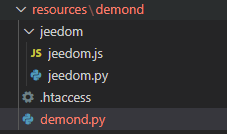

# Les démons & dépendances

## Introduction

Dans les tutoriels et documentations de base vous avez appris comment coder votre premier plugin avec des actions relativement simples déclenchées par l'utilisateur via une commande action ou par une tâche planifiée par le core (les crons).
Le plugin est alors capable de ponctuellement aller chercher de l'information (par exemple via requête http) ou de faire toute sortes d'opérations pour autant que cela puisse être codé en PHP.

Il va arriver que vous ayez besoin de plus que cela, quelques exemples sans être exhaustif:

- utiliser des resources systèmes, par exemple clé usb ou autres matériels (bluetooth...)
- maintenir une connexion avec un système distant (en local ou sur internet mais pas jeedom)
- garder des processus actifs en arrière plan ce qui n'est pas le cas du code PHP qui ne "vit" que pendant l'exécution de la requête http

Pour cela, la plupart du temps on utilise un "démon".
A nouveau, tout est déjà prévu dans le core de jeedom pour nous aider à mettre ce démon en place et on va détailler cela ici.

## Structure des fichiers

Le code et/ou l'executable de votre démon doit évidement se trouver dans l'arborescence de votre plugin et doit donc être inclus dans le package lors de l'installation d'un plugin.
Il n'y a pas de règle forte sur l'emplacement exact de votre démon, cependant la convention veut que l'on place celui-ci dans le dossier `./resources` à la racine du répertoire de votre plugin.



Dans le plugin template vous trouverez les bases pour implémenter un démon un python et c'est l'exemple que l'on va utiliser dans cette documentation cependant vous êtes libre de développer votre démon dans le langage de votre choix à condition qu'il puisse être executé sur les [plateformes supportées par Jeedom]( https://doc.jeedom.com/fr_FR/compatibility/)


## Configuration de base

Il y a quelques points à adapter dans un plugin de base pour activer la prise en charge d'un démon

### info.json

Dans le fichier info.json de votre plugin, il faut rajouter la propriété `hasOwnDeamon` et attribuer la valeur `true`, exemple:

```json
{
    "id" : "pluginID",
    "name" : "pluginName",
    ...
    "hasDependency" : true,
    "hasOwnDeamon" : true,
    "maxDependancyInstallTime" : 10,
    ...
}
```

Nous verrons plus tard l'utilisation de `hasDependency` et `maxDependancyInstallTime`.

### eqLogic class

Dans la class eqLogic de votre plugin il y a quelques méthodes à implémenter pour la bonne gestion du démon