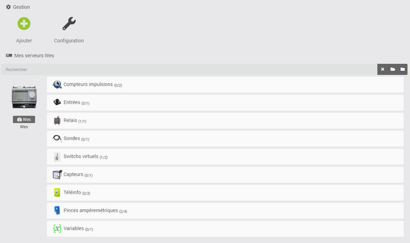

# Plugin WES Control

Ce plugin va vous permettre de prendre le contrôle de votre [**serveur d'énergie WES de CartElectronic**](https://www.cartelectronic.fr/content/8-serveur-wes){:target="\_blank"} et d'en récupérer toutes les données instantanément dans Jeedom.

>**IMPORTANT**
>
>Ce matériel étant en constante évolution, le plugin en version stable offre une pleine compatibilité avec les serveurs Wes de firmware inférieur à `V0.84A10` et la version beta avec les firmwares supérieurs ou égaux à `V0.84A10`.

# Configuration générale

## Configuration du plugin

Comme tout plugin Jeedom, le plugin **Wes Control** doit être activé après l'installation.

Le plugin **Wes Control** utilise son propre démon afin de rester en contact constant avec le serveur Wes. Vous pouvez en contrôler le statut sur la page de configuration du plugin.

>**INFORMATION**
>
>Il n'est pas nécessaire de se préoccuper de l'état du démon dès l'activation du plugin car la création du 1er équipement serveur Wes va automatiquement configurer et démarrer le démon.

Le plugin ne nécessite pas de configuration particulière mais propose un champ permettant de choisir le délai en secondes entre 2 interrogations du serveur Wes. *(30 secondes par défaut)*

>**IMPORTANT**
>
>Si vous diminuez cette valeur et constatez des lenteurs ou une instabilité du système, revenez à la valeur par défaut *(30)*.

## Configuration de l'équipement serveur Wes

Pour accéder aux différents équipements **Wes Control**, dirigez-vous vers le menu **Plugins → Energie → Wes Control**.

>**INFORMATION**
>
>Le bouton **+ Ajouter** permet d'ajouter un nouveau serveur Wes.

Après avoir créé votre équipement serveur Wes, cliquez sur celui-ci pour accéder à la configuration des accès ainsi qu'à la gestion des équipements/fonctionnalités.

Renseignez les informations générales de l'équipement puis indiquez si vous possédez des matériels optionnels branchés sur le Wes tels qu'un écran ou une alimentation 9 Volts pour la mesure de la tension secteur en cochant les cases correspondantes.

Ensuite, renseignez les informations d'accès au serveur Wes en HTTP afin de pouvoir communiquer avec lui :
- **IP du Wes** : adresse IP sur laquelle le serveur Wes est joignable.
- **Port du Wes** *(facultatif)* : port sur lequel le serveur Wes est joignable *(80 par défaut)*.
- **Identifiant HTTP** : identifiant permettant de communiquer en HTTP avec le serveur Wes.
- **Mot de passe HTTP** : mot de passe permettant de communiquer en HTTP avec le serveur Wes.

Le plugin **Wes Control** intègre un fichier spécialement conçu pour Jeedom et permettant d'avoir accès à davantage de données que celles disponibles normalement par défaut. Il est nécessaire d'établir une connexion FTP avec le serveur Wes pour y transférer ce fichier, les champs suivants doivent donc être complétés également :
- **Identifiant FTP** : identifiant permettant de communiquer en FTP avec le serveur Wes.
- **Mot de passe FTP** : mot de passe permettant de communiquer en FTP avec le serveur Wes.
- **Fichier CGX Jeedom** : cocher la case pour utiliser le fichier CGX Jeedom.
- **Envoyer fichier CGX** : Une fois les informations de connexion FTP renseignées, cliquez sur ce bouton pour transférer immédiatement le fichier sur le Wes.

>**INFORMATION**
>
>Les informations de connexion au serveur Wes sont consultables depuis l'interface internet du Wes dans le menu **Configuration → Accès sécurisé**.

## Gestion des équipements/fonctionnalités

La partie **Gestion des équipements** va vous permettre de sélectionner les fonctionnalités du Wes à activer/désactiver.

Chaque **case cochée** aura pour conséquence la **création automatique de l'équipement correspondant**, et à l'inverse, **chaque case décochée** aura pour conséquence la **suppression automatique de l'équipement correspondant** :

# Configuration des équipements/fonctionnalités

De retour sur la page générale du plugin **Wes Control**, les équipements activés précédemment sont regroupés par serveur et triés dans des menus accordéons classés par type de fonctionnalité.

Le champ de recherche permet la visualisation immédiate de l'équipement recherché. Sur la droite, l'icône en forme de croix annule la recherche, le dossier ouvert déplie tous les menus et le dossier fermé replie l'ensemble.

>**ASTUCE**
>
>Il est possible de réorganiser chaque menu dans la liste en restant cliqué dessus le temps de le positionner à l'endroit voulu.

Comme à l'habitude, le clic sur un équipement vous amène sur sa page de configuration permettant de renseigner les informations générales et de visualiser la liste des commandes.

## Paramètres optionnels des équipements

Certains équipements sont dotés de paramètres de configuration complémentaires qu'il faudra renseigner lors de leur activation.

Ces paramètres peuvent être le type de mesure à relever pour des pinces ampèremétriques *(consommation ou production)* ou la formule d'abonnement électrique concernant la téléinfo par exemple.

D'autres peuvent concerner la sélection d'un type de matériel spécifique afin de personnaliser les images d'illustration des équipements comme le type de compteur à impulsions *(eau, gaz, gazpar)* ou le type de pince ampèremétrique utilisé *(20 Ampères ou 100 Ampères)* entre autre.

## Interface du WES

Sur chaque page d'équipement (y compris l'équipement serveur Wes) se trouve, en haut à droite, un bouton bleu nommé **Interface Wes** qui permet d'ouvrir l'interface internet du serveur Wes dans un nouvel onglet de votre navigateur.

En fonction du type d'équipement sur lequel vous vous trouvez, vous serez automatiquement redirigé vers la page d'interface correspondant à cette fonctionnalité.

# Évolutions à venir

L'équipe travaille d'ores et déjà à l'intégration des extensions Wes actuellement non prises en charge telles que l'extension 8 relais ou modbus et fera son maximum pour faire évoluer le plugin en ce sens dans les meilleurs délais.
