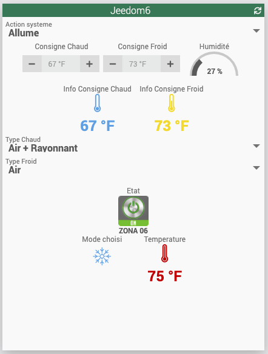

# Plugin Airzone

# Description

Plugin pour gérer vos systèmes AirzoneWeb

# Prérequis

 - Jeedom v4.1.22
 - Connaître l'adresse IP de votre AirzoneWeb Serveur

# Installation

Après téléchargement du plugin, il faut tout d’abord activer celui-ci, comme tout plugin Jeedom.

# Configuration

Rendez vous dans le menu Plugins/Gestion des plugins

Cliquez sur votre plugin, et configurez le avec l'adresse IP de votre AirzoneWebServer ainsi que le port (par défaut, les systèmes Airzone ont un port configuré sur 3000)
Le nombre de systèmes est détecté automatiquement à l'ajout de nouvel équipement.

Choisir le Cron souhaité pour le refresh des valeurs : 1min, 5, 10, 15, 30, Hourly ou Daily.

En cliquant sur le bouton Ajouter DriverName, vous pourrez modifier le nom du driver sur votre système Airzone.

Sauvegardez

# Ajout d'équipement

Rendez vous dans le menu Plugins/Confort/AirzoneJeedom

Cliquez sur Ajouter.

Les zones disponibles sur votre système seront disponible dans le menu déroulant.
Choisir une zone pour un équipement

Penser a Activer et rendre Visible votre équipement, et lui attribuer un parent pour le retrouver sur votre dashboard.

IMPORTANT : Si vous avez une zone qui comporte des caractères speciaux, cela peut provoquer une erreur de type SystemOut of Range. 

# Dashboard

Après la création de vos équipements, vous les retrouverez sur le dashboard.

Les icônes de mode changent suivant le mode sélectionné: Froid, Chaud, Ventilation, Dry, et Stop.

Pour bénéficier des icônes en couleur, pensez à vous rendre dans les réglages de votre Jeedom (Réglages/Système/Configuration/Interface), et de cocher "Icones Widgets colorées"

Seule les zones Master ont le menu déroulant pour changer le mode dans les zones associées parametrées dans votre système

Les icones d'infos Consigne et Temperature changent suivant des fenetres de valeurs : -20°c, entre 20 et 25°C, plus de 25°C ( et l'équivalent si la zone est reglée en Fahrenheit)

Les choix disponibles dans les modes, ou les vitesses de ventilateurs sont détectées suivant les possibilités de votre système.

Un équipement type :

Un équipement d'une master zone; on voit une commande supplémentaire pour activer un même mode sur tous les zones associées du système

